# Детальная архитектура

Platform V Pangolin - система управления базами данных, основанная на PostgreSQL. В этом документе описывается архитектура системы Pangolin и её элементов.

Этот документ предназначен для специалистов, занимающихся обслуживанием системы и работой с ней, а также для разработчиков приложений, работающих с системой.

## Назначение

В этом разделе описывается назначение программного продукта.

### Цель создания

Platform V Pangolin – это объектно-реляционная система управления базами данных, основанная на свободно распространяемой версии PostgreSQL. Она содержит ряд доработок, позволяющих обеспечить повышенные требования к безопасности хранимых данных, доступности, надежности и производительности.

Ключевые функциональные особенности:

-   гибкое управление парольными политиками;
-   прозрачное шифрование хранимой информации;
-   защита от привилегированных пользователей;
-   аудирование действий пользователей;
-   автоматическое развертывание и конфигурирование кластера высокой доступности;
-   интеграция с инфраструктурой банка: LDAP, система резервного копирования, система мониторинга, ДИ;
-   функционирование в виртуальной и облачной среде;
-   инкрементальное резервное копирование;
-   сквозная аутентификация при использовании `pgBouncer`;
-   поддержка `prepared statements` для транзакционного режима кластера высокой доступности;
-   соответствие четвертому уровню доверия по ФСТЭК.

PostgreSQL — это объектно-реляционная система управления базами данных, основанная на POSTGRES 4.2 — программе, разработанной на факультете компьютерных наук Калифорнийского университета в Беркли. PostgreSQL — СУБД с открытым исходным кодом, основой которого был код, написанный в Беркли. Она поддерживает большую часть стандарта SQL и предлагает множество современных функций:

-   сложные запросы;
-   внешние ключи;
-   триггеры;
-   изменяемые представления;
-   транзакционная целостность;
-   многоверсионность.

Кроме того, пользователи могут всячески расширять возможности PostgreSQL, например, создавая свои

-   типы данных;
-   функции;
-   операторы;
-   агрегатные функции;
-   методы индексирования;
-   процедурные языки.

Благодаря свободной лицензии PostgreSQL разрешается бесплатно использовать, изменять и распространять всем и для любых целей — личных, коммерческих или учебных.

### Основные функции

Platform V Pangolin обеспечивает выполнение следующих функций:

#### Поддержка параллельных транзакций без взаимной блокировки сеансов с использованием версионности данных (MVCC)

PostgreSQL предоставляет разработчикам богатый набор средств для управления конкурентным доступом к данным. Внутри он поддерживает целостность данных, реализуя модель MVCC (Multiversion Concurrency Control, Многоверсионное управление конкурентным доступом). Это означает, что каждый SQL-оператор видит снимок данных (версию базы данных) на определённый момент времени вне зависимости от текущего состояния данных. Это защищает операторы от несогласованности данных, возможной, если другие конкурирующие транзакции внесут изменения в те же строки данных, и обеспечивает тем самым изоляцию транзакций для каждого сеанса баз данных. MVCC, отходя от методик блокирования, принятых в традиционных СУБД, снижает уровень конфликтов блокировок и таким образом обеспечивает более высокую производительность в многопользовательской среде.

Основное преимущество использования модели MVCC по сравнению с блокированием заключается в том, что блокировки MVCC, полученные для чтения данных, не конфликтуют с блокировками, полученными для записи, и поэтому чтение никогда не мешает записи, а запись чтению. PostgreSQL гарантирует это даже для самого строгого уровня изоляции транзакций, используя инновационный уровень изоляции SSI (Serializable Snapshot Isolation, Сериализуемая изоляция снимков).

Для приложений, которым в принципе не нужна полная изоляция транзакций и которые предпочитают явно определять точки конфликтов, в PostgreSQL также есть средства блокировки на уровне таблиц и строк. Однако при правильном использовании MVCC обычно обеспечивает лучшую производительность, чем блокировки. Кроме этого, приложения могут использовать рекомендательные блокировки, не привязанные к какой-либо одной транзакции.

#### Изоляция транзакций

Стандарт SQL определяет четыре уровня изоляции транзакций. Наиболее строгий из них — сериализуемый, определяется одним абзацем, говорящим, что при параллельном выполнении несколько сериализуемых транзакций должны гарантированно выдавать такой же результат, как если бы они запускались по очереди в некотором порядке. Остальные три уровня определяются через описания особых явлений, которые возможны при взаимодействии параллельных транзакций, но не допускаются на определённом уровне. Как отмечается в стандарте, из определения сериализуемого уровня вытекает, что на этом уровне ни одно из этих явлений не возможно. (В самом деле — если эффект транзакций должен быть тем же, что и при их выполнении по очереди, как можно было бы увидеть особые явления, связанные с другими транзакциями?)

Стандарт описывает следующие особые условия, недопустимые для различных уровней изоляции:

-   «грязное» чтение: транзакция читает данные, записанные параллельной незавершённой транзакцией;
-   неповторяемое чтение: транзакция повторно читает те же данные, что и раньше, и обнаруживает, что они были изменены другой транзакцией (которая завершилась после первого чтения);
-   фантомное чтение: транзакция повторно выполняет запрос, возвращающий набор строк для некоторого условия, и обнаруживает, что набор строк, удовлетворяющих условию, изменился из-за транзакции, завершившейся за это время;
-   аномалия сериализации: результат успешной фиксации группы транзакций оказывается несогласованным при всевозможных вариантах исполнения этих транзакций по очереди.

#### Явные блокировки

Для управления параллельным доступом к данным в таблицах PostgreSQL предоставляет несколько режимов явных блокировок. Эти режимы могут применяться для блокировки данных со стороны приложения в ситуациях, когда MVCC не даёт желаемый результат. Кроме того, большинство команд PostgreSQL автоматически получают блокировки соответствующих режимов, защищающие от удаления или изменения задействованных таблиц, несовместимого с характером выполняемой команды. (Например, TRUNCATE не может безопасно выполняться одновременно с другими операциями с этой таблицей, так что во избежание конфликта эта команда получает исключительную блокировку для данной таблицы.)

Список текущих активных блокировок на сервере можно получить, прочитав системное представление pg\_locks.

#### Проверки целостности данных на уровне приложения

Используя транзакции Read Committed, очень сложно обеспечить целостность данных с точки зрения бизнес-логики, так как представление данных смещается с каждым оператором и даже один оператор может не ограничиваться своим снимком состояния в случае конфликта записи.

Хотя транзакция Repeatable Read получает стабильное представление данных в процессе выполнения, с использованием снимков MVCC для проверки целостности данных всё же связаны тонкие моменты, включая так называемые конфликты чтения/записи. Если одна транзакция записывает данные, а другая в это же время пытается их прочитать (до или после записи), она не может увидеть результат работы первой. В таком случае создаётся впечатление, что читающая транзакция выполняется первой вне зависимости от того, какая из них была начата или зафиксирована раньше. Если этим всё и ограничивается, нет никаких проблем, но если читающая транзакция также пишет данные, которые читает параллельная транзакция, получается, что теперь эта транзакция будет исполняться, как будто она запущена перед другими вышеупомянутыми. Если же транзакция, которая должна исполняться как последняя, на самом деле зафиксирована первой, в графе упорядоченных транзакций легко может возникнуть цикл. И когда он возникает, проверки целостности не будут работать правильно без дополнительных мер.

Сериализуемые транзакции представляют собой те же транзакции Repeatable Read, но дополненные неблокирующим механизмом отслеживания опасных условий конфликтов чтения/записи. Когда выявляется условие, приводящее к циклу в порядке транзакций, одна из этих транзакций откатывается и этот цикл таким образом разрывается.

#### Ограничения

Некоторые команды DDL, в настоящее время это TRUNCATE и формы ALTER TABLE, перезаписывающие таблицу, не являются безопасными с точки зрения MVCC. Это значит, что после фиксации усечения или перезаписи таблица окажется пустой для всех параллельных транзакций, если они работают со снимком, полученным перед фиксацией такой команды DDL. Это может проявиться только в транзакции, которая не обращалась к таблице до момента начала команды DDL — любая транзакция, которая обращалась к ней раньше, получила бы как минимум блокировку ACCESS SHARE, которая заблокировала бы эту команду DDL до завершения транзакции. Поэтому такие команды не приводят ни к каким видимым несоответствиям с содержимым таблицы при последовательных запросах к целевой таблице, хотя возможно видимое несоответствие между содержимым целевой таблицы и другими таблицами в базе данных.

Поддержка уровня изоляции Serializable ещё не реализована для целевых серверов горячего резерва. На данный момент самый строгий уровень изоляции, поддерживаемый в режиме горячего резерва, это Repeatable Read. Хотя и тогда, когда главный сервер выполняет запись в транзакциях Serializable, все резервные серверы в итоге достигают согласованного состояния, но транзакция Repeatable Read на резервном сервере иногда может увидеть промежуточное состояние, не соответствующее результату последовательного выполнения транзакций на главном сервере.

#### Ссылочная целостность данных

Ссылочная целостность двух связанных таблиц означает, что значения столбца (или группы столбцов) должны соответствовать значениям в некоторой строке другой таблицы. Это достигается с помощью ограничения внешнего ключа.

Пример использования:

Дана таблица продуктов:

```SQL
CREATE TABLE products (
    product_no integer PRIMARY KEY,
    name text,
    price numeric
);
```

Существует некая таблица с заказами этих продуктов. Требуется, чтобы в таблице заказов содержались только заказы действительно существующих продуктов. Для этого определяется ограничение внешнего ключа, ссылающееся на таблицу продуктов:

```sql
<pre><code>CREATE TABLE orders (
order_id integer PRIMARY KEY,
product_no integer <b>REFERENCES products (product_no)</b>,
quantity integer
);
</code></pre>
```

С таким ограничением создать заказ со значением `product_no`, отсутствующим в таблице `products` (и не равным `NULL`), будет невозможно.

#### Поддержка реализации пользовательских типов данных

PostgreSQL может расширяться и поддерживать новые типы данных.

Для создания нового базового типа необходимо реализовать функции, работающие с этим типом, на языке низкого уровня, обычно C. Пользовательский тип должен всегда иметь функции ввода и вывода. Эти функции определяют, как тип будет выглядеть в строковом виде (при вводе и выводе для пользователя) и как этот тип размещается в памяти.

Функция ввода принимает в качестве аргумента строку символов, заканчивающуюся нулём, и возвращает внутреннее представление типа (в памяти).

Функция вывода принимает в качестве аргумента внутреннее представление типа и возвращает строку символов, заканчивающуюся нулём.

Для выполнения других операций с типом должны быть представлены дополнительные функции, реализующие эти операции.

#### Защита данных от привилегированных пользователей (администраторов баз данных)

В Platform V Pangolin используется механизм защиты данных от привилегированных пользователей, построенный на принципе разделения ролей.

В стандартном PostgreSQL привилегированные пользователи имеют доступ к объектам БД и настройкам подключения:

-   администраторы БД имеют произвольный доступ к любым пользовательским данным, что может привести к утечкам конфиденциальной информации;
-   администраторы ОС могут менять настройки БД таким образом, чтобы получать доступ к пользовательским данным, что тоже ведет к утечкам.

В Platform V Pangolin Администраторы БД и ОС теряют возможность самостоятельно управлять некоторыми параметрами и перестают иметь полный доступ ко всем объектам БД.

В дополнение к роли суперпользователя, которая есть в стандартной версии PostgreSQL, в Pangolin можно создать специальную роль Администратора безопасности (АБ).

АБ – независимый администратор, не обладающий особыми правами в операционной системе (в том числе не имеющий прав linux пользователя postgres) и не имеющий доступа к объектам БД. Внутри БД роль Администратора безопасности является особенной в том смысле, что она не может быть изменена суперпользователем.

Таким образом, ни один из пользователей не может единолично получить доступ к конфиденциальным данным или изменять важные для безопасности настройки БД и права доступа.

#### Прозрачное шифрование данных, включая интеграцию с системами класса key management для хранения мастер-ключей

В Platform V Pangolin используется прозрачное шифрование данных (TDE). С его помощью шифруются данные, хранящиеся в файлах данных, журналах изменений, резервных копиях и временных файлах баз данных, а также данные, передаваемые по каналам связи в ходе физической и логической репликации.

Для шифрования данных используется алгоритм шифрования AES, реализованный в рамках модуля Encryption support. Ключи шифрования организуются в двухуровневую иерархию, корнем которой является мастер-ключ, который регулярно изменяется. Мастер-ключ используется для шифрования ключей второго уровня (ключей шифрования объектов баз данных).

Ключи шифрования второго уровня не ротируются, поэтому при смене мастер-ключа перешифровывать данные не требуется. Ротация мастер-ключа инициируется и выполняется на главном сервере СУБД PostgreSQL.

Если во время перешифрования ключей происходит отказ СУБД, то для восстановления шифрования ключей используется функция восстановления шифрования. Серверы кластера периодически проверяют соответствие текущего мастер-ключа мастер-ключу из защищенного хранилища (KMS). При обнаружении несоответствия выполняется процедура перешифрования: ключи второго уровня расшифровываются старым мастер-ключом и зашифровываются заново актуальным мастер-ключом, получаемым из KMS.

#### Функционирование в режиме отказоустойчивого кластера: физическая репликация данных и автоматическое переключение клиентских приложений на реплику в случае аварии

PostgreSQL рекомендуется использовать в режиме кластера высокой доступности. Целевая схема такого кластера представлена ниже:

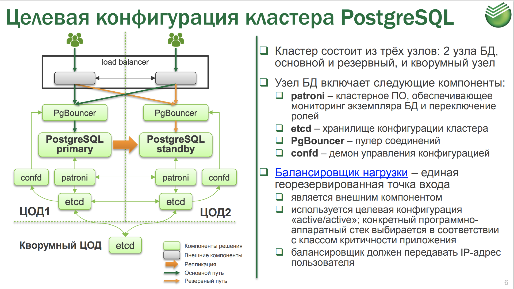

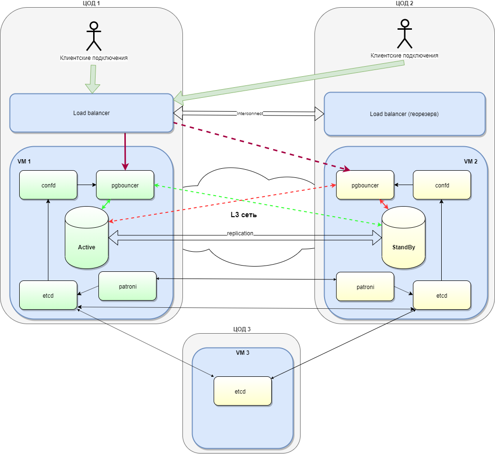

Такая конфигурация обладает следующими преимуществами:

1.  Обеспечивается катастрофоустойчивое подключение к БД через одну точку входа.
2.  Обеспечивается возможность достижения **RTO = 6**, но практическое подтверждение возможно по результатам длительной эксплуатации.
3.  **RPO = 0 выполняется**, кроме случая, описанного в недостатках решения.
4.  Простая в конфигурировании и эксплуатации схема с минимумом потребляемых ресурсов сервера.
5.  Patroni имеет внешний интерфейс для управления состоянием кластера и единую точку конфигурирования всех серверов БД, входящих в кластер.
6.  Несмотря на добавление в конфигурацию дополнительного сервиса, схема остается простой для установки и настройки - pgbouncer имеет единый файл для конфигурирования и обладает простым синтаксисом настроек.
7.  Позволяет гибко управлять настройками пулов соединений.
8.  Pgbouncer обеспечивает большее количество соединений, чем сконфигурировано в БД.
9.  Pgbouncer позволяет обеспечить стабильную скорость обработки транзакций даже в случае превышения лимита возможных одновременных подключений к БД, согласно конфигурации.
10. В pgbouncer можно реализовать автоматическое перенаправление трафика к новому ведущему серверу на основе информации из Etcd.
11. **RPO = 0** выполняется, так как балансировщик автоматически перенаправит трафик от клиентов на ведущий сервер в соответствии с разработанной стратегией.
12. Балансировщики нагрузки промышленных стендов размещаются в соответствии с принципами георезервирования.
13. Позволяет реализовать большинство стратегий уровня L3/L7, кроме стратегий прикладного уровня: например, балансировку трафика с учетом информации от БД.
14. **Рекомендация:** использование схемы с pgbouncer имеет смысл, когда планируемое максимальное количество подключений max\_connections превышает число, рассчитанное по формуле 3хCPU (включая виртуальные (hyperthreading) ядра). Например, для типовой конфигурации промышленного сервера (28 CPU) рекомендованное число подключений на уровне БД - 84. Если требуется больше, следует использовать PgBouncer.

Система обладает следующими ограничениями:

1.  Без включенной опции SSL patroni и pgbouncer являются уязвимым местами с точки зрения безопасности.
2.  В специфическом случае отказа pgbouncer на ноде с ведущим сервером все запросы пойдут через pgbouncer ведомого сервера, что приведет к увеличению сетевых задержек.
3.  Клиентское приложение должно уметь работать с БД в режиме транзакций в соответствии с рекомендуемыми настройками pgbouncer.
4.  Разработка алгоритма балансировки может потребовать понимания работы сетевых протоколов и знания SLA сетевой доступности между ЦОДами. Возможно, потребуется корректировка алгоритма постфактум, на основе логов работы в реальном окружении.

### Cценарии использования

PostgreSQL разработана для использования в следующих сценариях:

-   OLTP, аналитика и бизнес-аналитика: Pangolin полностью совместима с ACID и поэтому идеально подходит для нагрузок OLTP (Online Transaction Processing). При этом PostgreSQL Sber Edition также может быть интегрирована с математическим программным обеспечением в качестве высокопроизводительной аналитической базы данных. Рекомендуется использовать Pangolin на объемах данных до 10 Тб;
-   Автоматическое восстановление после отказа и нулевое время простоя: Pangolin - это надежное долговременное хранилище данных. В промышленной эксплуатации надежность имеет первоочередное значение. Если промышленный сервис не работает из-за сбоя, компания может понести миллионные убытки. Pangolin решает эту проблему, потому что обеспечивает автоматическое переключение при сбое, полное резервирование и практически нулевое время простоя;
-   Масштабируемые рабочие нагрузки с PostgreSQL: cовременные приложения для обслуживания клиентов могут обрабатывать сотни тысяч запросов в секунду. Возможности репликации Pangolin позволяют без труда масштабировать на столько серверов баз данных, сколько потребуется.

### Нефункциональные требования к сервису

Сервис отвечает следующим требованиям:

-   10000 tps (Испытания проводились с пулом подключений 50, при дальнейшем исследовании достижение подобных характеристик возможно при увеличении пула соединений);
-   объем БД = 10 ТБ (Испытания проводились на БД объемом 1.6 Тб);
-   2500 одновременных активных подключений;
-   установка 100 новых подключений в секунду.

## Структура

В этом разделе описывается структура программного продукта.

### Компонентно-логическая диаграмма

В этом разделе представлены компонентно-логические диаграммы сервиса в разных вариантах развертывания кластера.

> В зависимости от конфигурации база данных может включать в себя разное число компонентов. На диаграммах указаны только те компоненты, которые важны для логического представления системы.

**Pangolin + Patroni + Etcd + pgbouncer**

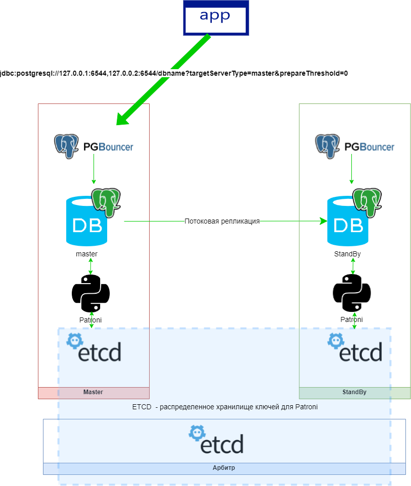

**Pangolin + Patroni + Etcd + pgbouncer + HAProxy**

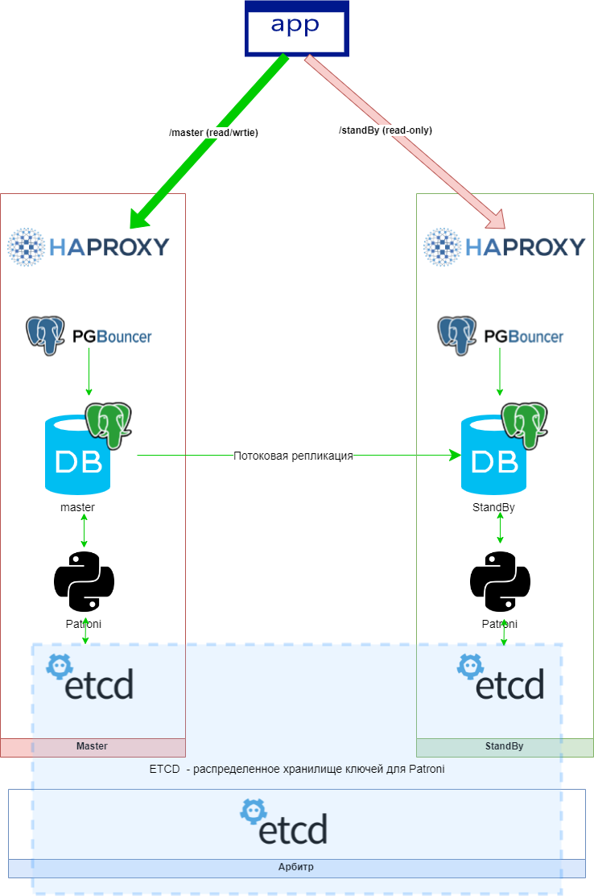

**Pangolin + Patroni + Etcd + pgBouncer + БН (балансировщик нагрузки)**

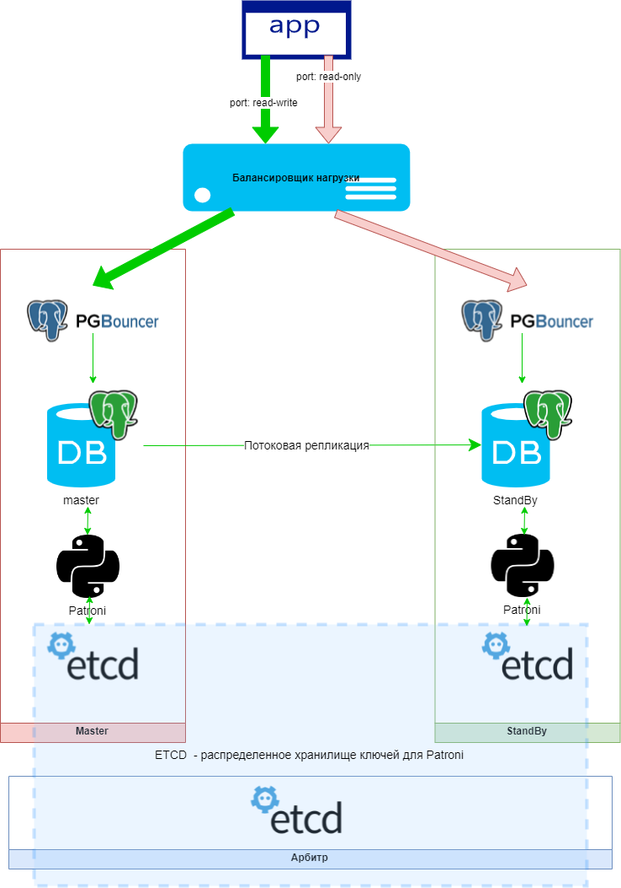

**Standalone: Pangolin + Patroni + Etcd + pgBouncer**

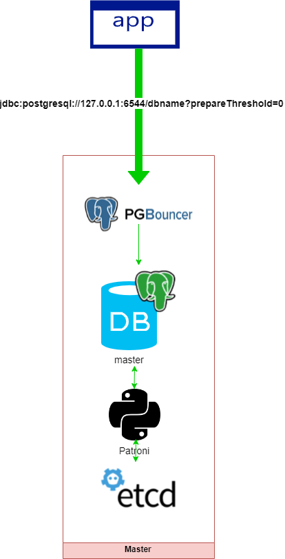

**Standalone: Pangolin + pgBouncer**

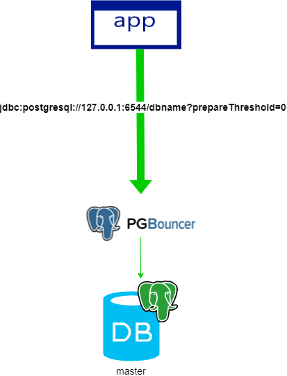

### Компоненты сервиса

Помимо доступных в базовой версии, Pangolin включает в себя следующие компоненты:

-   Механизм защиты доступа к объектам баз данных PostgreSQL – это набор API-функций базы данных, которые доступны только администратору безопасности и действуют параллельно стандартному механизму прав доступа PostgreSQL;
-   Encryption Support - это модуль, который обеспечивает прозрачное шифрование данных (TDE). С его помощью шифруются данные, хранящиеся в файлах данных, журналах изменений, резервных копиях и временных файлах баз данных, а также данные, передаваемые по каналам связи в ходе физической и логической репликации;
-   pgaudit - расширение для PostgreSQL, которое позволяет собирать события из различных источников внутри PostgreSQL и записывает их в формате CSV c временной меткой, информацией о пользователе, объекте, который был затронут командой (если такое произошло) и полным текстом команды;
-   patroni - это утилита для создания высоконадежного и высокодоступного кластера PostgreSQL. Она работает с распределенными хранилищами конфигураций (DSC): etcd, Consul, ZooKeeper;
-   pgBouncer - это менеджер соединений (pooler), который группирует запросы от приложений и оптимизирует нагрузку на базу данных;
-   ora2pg - утилита для миграции с БД с Oracle на PostgreSQL;
-   etcd - распределенное Key-Value хранилище, которое запускается на каждой машине кластера и обеспечивает общий доступ практически ко всем данным в масштабе всего кластера;
-   confd - утилита для управления конфигурациями;
-   pgcenter - утилита для поиска и устранения неполадок с PostgreSQL;
-   HAProxy - инструмент для обеспечения высокой доступности и балансировки нагрузки для TCP и HTTP-приложений посредством распределения входящих запросов на несколько обслуживающих серверов;
-   pg\_pathman - это расширение, реализующее оптимизированное решение для секционирования больших и распределённых баз данных;
-   pg\_cron - расширение для планирования задач формата cron в PostgreSQL;
-   pg\_repack - это инструмент для реорганизации таблиц без эксклюзивной блокировки. Он позволяет реорганизовать таблицы и индексы к ним и переносить таблицы и индексы в другое табличное пространство;
-   pgcompacttable - альтернативный инструмент для реорганизации таблиц без эксклюзивной блокировки. Работает медленнее, чем pg\_repack, но позволяет регулировать влияние на производительность и не занимает места на диске.

### Интерфейсы

В дистрибутив Pangolin включены следующие интерфейсы:

#### libpq

Включён в базовую версию PostgreSQL, потому что это основной интерфейс языка C и многие другие клиентские интерфейсы построены на основе него.

#### ECPG

Включён в базовую версию PostgreSQL, потому что он зависит от грамматики языка SQL на стороне сервера, и, таким образом, очень чувствителен к изменениям в самом PostgreSQL.

#### Интерфейс администратора безопасности PostgreSQL

Интерфейс администратора безопасности включает в себя следующие функции:

-   `pm_get_protected_objects ()` - возвращает список объектов, находящихся под защитой;
-   `pm_protect_object` (имя базы данных, типа объекта, наименование объекта) - помещает объект под защиту; 
-    `pm_unprotect_object` (имя базы данных, типа объекта, наименование объекта) - снимает защиту с объекта;
-   `pm_make_policy` (имя политики) - создает политику;
-   `pm_grant_to_policy` (имя политики, имя базы данных, типа объекта, наименование объекта, массив действий над объектом) - вносит в политику разрешение на действия над объектом;
-   `pm_revoke_from_policy` (имя политики, имя базы данных, типа объекта, наименование объекта, массив действий над объектом) - исключает из политики разрешения на действия над объектом;
-   `pm_assign_policy_to_user` (имя пользователя, имя политики) - назначает политику пользователю;
-   `pm_unassign_policy_from_user` (имя пользователя, имя политики) - изымает политику у пользователя;
-   `pm_get_assigned_policies` (имя пользователя) - получает список политик, назначенных пользователю;
-   `pm_get_policy_grants` (имя политики) - получает список разрешений в составе политики;
-   `pm_get_policies` () - получает список политик;
-   `pm_grant_security_admin` (имя пользователя) - делает пользователя администратором безопасности;
-   `pm_revoke_security_admin` (имя пользователя) - снимает с пользователя политики администратора безопасности.

#### Интерфейс управления парольными политиками: PL/pgSQL API

Все запросы к базе выполняются через SPI интерфейс (т.е. не через внутренний API АС Pangolin), так как вероятность изменения SQL интерфейса меньше.

##### Вывод парольной политики, примененной для пользователя или роли

Вывод политики, приписанной этой роли

*Формат*

-   `recognize_password_policy(name role_name)` - по имени роли;
-   `recognize_password_policy_by_role_id(oid roleid)` - по идентификатору роли.

*Входные атрибуты*

-   `role_name` – имя роли;
-   `role_id` – идентификатор роли.

*Возвращаемое значение*

Кортеж с описанием политики.

##### Вывод детализированной информации по примененной парольной политике для пользователя или роли

Вывод эффективной политики, получившейся в сценарии (выбор политики для пользователя) с указанием, какая политика из какой роли (или из postgresql.conf) действует.

*Формат*

-   `recognize_password_policy_detailed(name role_name)` - по имени роли;
-   `recognize_password_policy_detailed_by_role_id(oid roleid)`- по идентификатору роли.

*Входные атрибуты*

-   `role_name` – имя роли;
-   `role_id` – идентификатор роли.

*Возвращаемое значение*

Кортеж с политикой с полями, указывающими роль (или строку config) для каждой политики.

##### Создание или изменение парольной политики

Приписать роли значения парольных политик.

> Для изменения параметра policy\_enable используйте функции активации и деактивации политики.

*Формат*

-   `set_role_policies(name role_name, policy1[, policy2[, ...]]);` - по имени роли
-   `set_role_policies_by_id(oid role_id, policy1[, policy2[, ...]]);` - по идентификатору роли

*Входные атрибуты*

-   `role_name` – имя роли;

-   `role_id` – идентификатор роли;

-   `policy1, policy2, …` – значение настройки парольной политики, задаётся специальной функцией.

    <table>
      <thead>
        <tr>
          <th>Имя настройки парольной политики</th>
          <th>Функция и ее синонимы</th>
          <th>POSIX шаблон для &lt;value&gt;</th>
        </tr>
      </thead>
      <tbody>
        <tr>
          <td>reusetime</td>
          <td>reuse_time(‘&lt;value&gt;’)</td>
          <td>s</td>
        </tr>
        <tr>
          <td>inhistory</td>
          <td>in_history(‘&lt;value&gt;’)</td>
          <td>
            <br/>
          </td>
        </tr>
        <tr>
          <td>maxage</td>
          <td>max_age(‘&lt;value&gt;’)</td>
          <td>s</td>
        </tr>
        <tr>
          <td>minage</td>
          <td>min_age(‘&lt;value&gt;’)</td>
          <td>s</td>
        </tr>
        <tr>
          <td>graceloginlimit</td>
          <td>grace_login_limit(‘&lt;value&gt;’), grace_li(‘&lt;value&gt;’)</td>
          <td>
            <br/>
          </td>
        </tr>
        <tr>
          <td>gracelogintimelimit</td>
          <td>grace_login_time_limit(‘&lt;value&gt;’), grace_lti(‘&lt;value&gt;’)</td>
          <td>s</td>
        </tr>
        <tr>
          <td>expirewarning</td>
          <td>expire_warning(‘&lt;value&gt;’)</td>
          <td>s</td>
        </tr>
        <tr>
          <td>lockout</td>
          <td>lockout(‘&lt;value&gt;’)</td>
          <td>true|false</td>
        </tr>
        <tr>
          <td>lockoutduration</td>
          <td>lockout_duration(), lduration(‘&lt;value&gt;’)</td>
          <td>s</td>
        </tr>
        <tr>
          <td>maxfailure</td>
          <td>max_failure(‘&lt;value&gt;’)</td>
          <td>
            <br/>
          </td>
        </tr>
        <tr>
          <td>failurecountinterval</td>
          <td>failure_count_interval(‘&lt;value&gt;’), fc_interval(‘&lt;value&gt;’)</td>
          <td>s</td>
        </tr>
        <tr>
          <td>checksyntax</td>
          <td>check_syntax(‘&lt;value&gt;’)</td>
          <td>true|false</td>
        </tr>
        <tr>
          <td>minlength</td>
          <td>min_length(‘&lt;value&gt;’)</td>
          <td>
            <br/>
          </td>
        </tr>
        <tr>
          <td>illegalvalues</td>
          <td>illegal_values(‘&lt;value&gt;’)</td>
          <td>true|false</td>
        </tr>
        <tr>
          <td>alphanumeric</td>
          <td>alpha_numeric(‘&lt;value&gt;’)</td>
          <td>
            <br/>
          </td>
        </tr>
        <tr>
          <td>minalphachars</td>
          <td>min_alpha_chars(‘&lt;value&gt;’)</td>
          <td>
            <br/>
          </td>
        </tr>
        <tr>
          <td>minspecialchars</td>
          <td>min_special_chars(‘&lt;value&gt;’)</td>
          <td>
            <br/>
          </td>
        </tr>
        <tr>
          <td>minuppercase</td>
          <td>min_uppercase(‘&lt;value&gt;’)</td>
          <td>
            <br/>
          </td>
        </tr>
        <tr>
          <td>minlowercase</td>
          <td>min_lowercase(‘&lt;value&gt;’)</td>
          <td>
            <br/>
          </td>
        </tr>
        <tr>
          <td>maxrptchars</td>
          <td>max_rpt_chars(‘&lt;value&gt;’)</td>
          <td>
            <br/>
          </td>
        </tr>
        <tr>
          <td>policyenable</td>
          <td>policy_enable(‘&lt;value&gt;’)</td>
          <td>true|false</td>
        </tr>
        <tr>
          <td>tracklogin</td>
          <td>track_login(‘&lt;value&gt;’)</td>
          <td>true|false</td>
        </tr>
        <tr>
          <td>maxinactivity</td>
          <td>max_inactivity(‘&lt;value&gt;’)</td>
          <td>s</td>
        </tr>
        <tr>
          <td>usepasswordstrengthestimator</td>
          <td>use_password_strength_estimator(‘&lt;value&gt;’), use_zxcvbn(‘&lt;value&gt;’)</td>
          <td>true|false</td>
        </tr>
        <tr>
          <td>passwordstrengthestimatorscore</td>
          <td>password_strength_estimator_score(‘&lt;value&gt;’), zxcvbn_score(‘&lt;value&gt;’)</td>
          <td>[0-4]</td>
        </tr>
        <tr>
          <td>customfunction</td>
          <td>custom_function(‘&lt;value&gt;’)</td>
          <td></td>
        </tr>
      </tbody>
    </table>

*Возвращаемое значение*

Функция вернет такой же результат, как функция `recognize_password_policy`, отобразив изменения.

*Пример*

Для пользователя `pg_user_name` установить максимальное количество подряд неверно введённых паролей 3 (`maxfailure`), время блокировки аккаунта (`lockoutduration`) 10 секунд.

```sql
select set_role_policies('pg_user_name', max_failure('3'), lockout_duration('10 s'));
```

##### Активация парольной политики

*Формат*

-   `enable_policy(name role_name);` - по имени роли;
-   `enable_policy(oid role_id);` - по идентификатору роли.

*Входные атрибуты*

-   `role_name` – имя роли;
-   `role_id` – идентификатор роли.

*Возвращаемое значение*

Функция вернет такой же результат, как функция `recognize_password_policy`, отобразив изменения.

##### Деактивация парольной политики

*Формат*

-   `disable_policy(name role_name);` - по имени роли;
-   `disable_policy(oid role_id);` - по идентификатору роли.

*Входные атрибуты*

-   `role_name` – имя роли;
-   `role_id` – идентификатор роли.

*Возвращаемое значение*

Функция вернет такой же результат, как функция `recognize_password_policy`, отобразив изменения.

##### Вывод всех политик

Поиск всех ролей, к которым прикреплены политики паролей.

*Формат*

`select_all_password_policies()`

*Входные атрибуты*

Нет

*Возвращаемое значение*

Кортеж со всеми найденными ролями.

##### Разблокировка пользователя или роли

Разблокировать пользователя, заблокированного в результате превышения максимального количества неудачных попыток аутентификации по паролю или долгой неактивности.

*Формат*

-   `unblock_role(name role_name)` - по имени роли;
-   `unblock_role_by_id(oid roleid)` - по идентификатору роли.

*Входные атрибуты*

-   `role_name` – имя роли;
-   `role_id` – идентификатор роли.

*Возвращаемое значение*

-   Для заданного пользователя или роли изменяется значение полей:

    -   failcounter = 0
    -   unblockexpirytime = &lt;текущее время на сервере&gt;

### Варианты развертывания

Pangolin поддерживает несколько вариантов развертывания с использованием разных сочетаний компонентов.

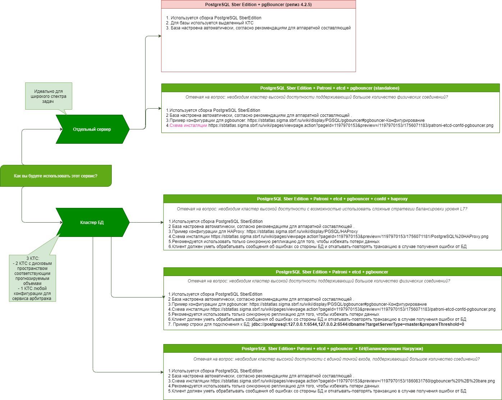

Компоненты, используемые в разных сценариях развертывания:

**Patroni** - это демон на Python, позволяющий автоматически обслуживать кластеры PostgreSQL с различными типами репликации.

**Etcd** - высоконадёжное распределённое хранилище параметров конфигурации, задаваемых в форме ключ/значение.

**Pgbouncer** - мультиплексоры соединений (программы для создания пула соединений), позволяют уменьшить накладные расходы на базу данных, в случае, когда огромное количество физических соединений ведет к падению производительности PostgreSQL.

**confd** - легковесный менеджер конфигураций, проверяющий хранилище параметров конфигураций и изменяющий конфигурационные файлы в зависимости от изменения ключа

**haproxy** - серверное программное обеспечение для обеспечения высокой доступности и балансировки нагрузки для TCP и HTTP-приложений

В таблице представлена компиляция результатов тестирования различных конфигураций кластера на соответствие следующему набору требований:

Функциональные требования (RTO = 6 минут, RPO = 0) 

Нефункциональные требования (10000 tps1, Объем БД = 10 ТБ2, 2500 одновременных активных подключений, установка 100 новых подключений в секунду)

<table>
 <thead>
  <tr>
   <td>Варианты конфигураций</td>
   <td>Преимущества</td>
   <td>Обнаруженные недостатки и ограничения</td>
  </tr>
 </thead>
 <tr>
  <td>Pangolin + pgBouncer (открытие - версия 4.2.5)</td>
  <td>
    <p>Схема Pangolin для АС, где не требуется соответствие заявленным нефункциональным требованиям
  (RTO = 6 минут, RPO = 0). Также возможно прерывание предоставляемого
  сервиса.</p>
    <p>Исключена возможная проблема с ПО арбитража, возникающая на виртуальных средах
  ДЕВ/ИФТ/ПСИ</p>
  </td>
  <td>
    <p><b>Ограничения:</b></p>
    <p>Не соответствует заявленным нефункциональным требованиям.</p>
  </td>
 </tr>
 <tr>
  <td>Patroni + Etcd + Pgbouncer, standalone</td>
  <td>
    <p>Схема кластера, используемая для тестовых сред, ввиду отдельного решения архитектурного совета запрещающая к использованию кластерного решения вне ПРОМ сред.</p>
    <p>Позволяет функционально проверить, что кластерная конфигурация подходит для использования в рамках АС, а также получить опыт эксплуатации</p>
  </td>
  <td>
    <p><b>Ограничения:</b></p>
    <p>Не соответствует заявленным нефункциональным требованиям</p>>
    <p><b>Недостатки:</b></p>>
    <p>Проблема с ПО арбитража, что может привести к переводу БД в режим Read-only. Проблема подтверждена для сред ДЕВ/ИФТ/ПСИ на виртуальных серверах в следствии использования opensource решения для виртуализации, которое не может обеспечить квотирование ресурсов сервера. На средах НТ/ПРОМ проблема исключена.</p>
  </td>
 </tr>
 <tr>
  <td>Patroni + Etcd + Pgbouncer</td>
  <td>
    <p>Обеспечивается возможность достижения RTO = 6, но практическое подтверждение возможно по результатам
  длительной эксплуатации RPO = 0 выполняется кроме случая, описанного в недостатках решения 
    <p>Простая в конфигурировании и эксплуатации схема с минимумом потребляемых ресурсов сервера.</p>
    <p>Patroni имеет внешний интерфейс для управления состоянием кластера и единую точку конфигурирования всех серверов БД, входящих в кластер. Несмотря на добавление в конфигурацию дополнительного сервиса, схема остается простой для установки и настройки - pgbouncer имеет единый файл для конфигурирования и обладает простым синтаксисом настроек</p>
    <p>Позволяет гибко управлять настройками пулов соединений</p>
    <p>Pgbouncer обеспечивает количество соединений большее, чем сконфигурировано в БД Pgbouncer позволяет обеспечить стабильную скорость обработки транзакций даже в случае превышения лимита возможных одновременных подключений к БД, согласно конфигурации</p>
    <p>В pgbouncer можно реализовать автоматическое перенаправление трафика к новому ведущему сервера на основе информации из Etcd</p>
    <p></p>
    <p><b>Рекомендация:</b></p>
    <p>Использование схемы с pgbouncer имеет смысл, когда планируемое максимальное количество подключений max_connections превышает число рассчитанное по формуле 3хCPU (включая виртуальные (hyperthreading) ядра. Например для типовой конфигурации промышленного сервера (28 CPU) - рекомендованное число подключений на уровне БД - 84, если требуется больше, то использовать PgBouncer5</p>
  </td>
  <td>
    <p><b>Ограничения:</b></p>
    <p>RPO равное 0 обеспечивается только в случае использования синхронной репликации и наличия механизма обработки timeout на стороне клиентского предложения, в случае следующих обнаруженных недостатков:</p>
    <p>RPO=0 не выполняется при использовании асинхронной репликации возможно возникновение ситуации &quot;split brain&quot;.</p>
    <p>При использовании асинхронной репликации с pg_rewind возможны расхождения в данных между ведущей и ведомой нодой.</p>
    <p>При использовании синхронной репликации c включенным pg_rewind необходима обработка timeout на стороне клиента, так как запросы не будут завершаться до получения ответа от ведомого сервера.</p>
    <p>При использовании синхронной репликации с отключенным pg_rewind данные, полученные до переключения кластера на новый мастер, останутся только на &quot;старом&quot; мастере.</p>
    <p>Необходимо использовать измененную строку подключения на стороне АС для того, чтобы отправлять все запросы на ведущий сервер кластера, пример для JDBC jdbc://postgresql:127.0.0.1:6544,127.0.0.2:6544/dbname?targetServerType=master&amp;prepareThreshold=0</p>
    <p>Клиентское приложение должно уметь работать с БД в режиме транзакций в соответствии с рекомендуемыми настройками pgbouncer</p>
    <p></p>
    <p><b>Недостатки:</b></p>
    <p>RPO = 0 не обеспечивается, возможно возникновение ситуации Split Brain</p>
    <p>Использование PgBouncer при небольшом числе соединений не несет никакого выигрыша и приводит только к незначительному росту накладных расходов</p>
    <p>В кластере происходит снижение скорости в среднем на 30% из-за накладных расходов на инфраструктуру - etcd, Patroni и др.</p>
  </td>
 </tr>
 <tr>
  <td>Patroni + Etcd + Pgbouncer + Haproxy</td>
  <td>
    <p>Те же, что и для <b>Patroni + Etcd + Pgbouncer</b>.</p>
    <p>Обеспечивает возможность реализовать различные стратегии балансировки трафика между нодами кластера, в том числе балансировку уровня БД. К примеру, балансировку запросов чтения между всеми ведомыми нодами с учетом времени отставания ведомой ноды.</p>
    <p>HAProxy обладает обширной документацией и возможностью настройки.</p>
    <p>Возможность организовать автоматический обрыв соединений в случае смены ролей в кластере</p>
  </td>
  <td>
    <p><b>Ограничения:</b></p>
    <p>В специфическом случае падения HAProxy на ноде с ведущим сервером все запросы пойдут через Haproxy ведомого сервера, что может привести к увеличению сетевых задержек</p>
    <p>Настройка алгоритма балансировки может потребовать понимания работы сетевых протоколов и знания SLA сетевой доступности между ЦОДами. Возможно, потребуется корректировка алгоритма постфактум, на основе логов работы в реальном окружении</p>
    <p>Клиенты должны будут реализовать функциональность переподключения к кластеру и повторной отправки запросов</p>
    <p></p>
    <p><b>Недостатки:</b></p>
    <p>В кластере происходит снижение скорости в среднем на 30% из-за накладных расходов на инфраструктуру - etcd, Patroni и др.</p>
    <p>Использование PgBouncer при небольшом числе соединений не несет никакого выигрыша и приводит только к росту накладных расходов и, как следствие, падении скорости обработки запросов</p>
  </td>
 </tr>
 <tr>
  <td>Patroni + Etcd + pgbouncer + Балансировщик нагрузки</td>
  <td>
    <p>Те же, что и для <b>Patroni + Etcd + Pgbouncer</b></p>
    <p>Предоставляет единую точку входа для клиентский соединений.</p>
    <p>RPO = 0 выполняется, так как балансировщик автоматически перенаправляет трафик от клиентов на ведущий сервер в соответствии с разработанной стратегией</p>
    <p>Балансировщики нагрузки промышленных стендов размещаются в соответствии с принципами георезервирования.</p>
    <p>Наличие команды поддержки БН</p>
    <p>Позволяет реализовать большинство стратегий уровня L3/L7, кроме стратегий прикладного уровня, например, балансировку трафика с учетом информации от БД</p>
    <p></p> 
    <p><b>Рекомендация:</b></p> 
    <p>Использование схемы с pgbouncer имеет смысл, когда планируемое максимальное количество подключений max_connections превышает число, рассчитанное по формуле 3хCPU (включая виртуальные (hyperthreading) ядра). Например, для типовой конфигурации промышленного сервера (28 CPU) рекомендованное число подключений на уровне БД - 84, если требуется больше, следует использовать PgBouncer</p>
  </td>
  <td>
    <p><b>Ограничения:</b></p>
    <p>Клиентское приложение должно уметь работать с БД в режиме транзакций в соответствии с рекомендуемыми настройками pgbouncer</p>
    <p>Разработка алгоритма балансировки может потребовать понимания работы сетевых протоколов и знания SLA сетевой доступности между ЦОДами. Возможно, потребуется корректировка алгоритма постфактум, на основе логов работы в реальном окружении</p>
    <p>Клиенты должны будут реализовать функциональность переподключения к кластера и повторной отправки запросов.</p>
    <p>Балансировщик нагрузки является черным ящиком по отношению к потребителям, что может привести к увеличения времени понимания и исправления проблемы с балансированием запросов.</p>
    <p></p>
    <p><b>Недостатки:</b></p>
    <p>Дороговизна решения: балансировщик нагрузки хоть и является георезервированным и отказоустойчивым, но при этом имеет высокую стоимость эксплуатации. Рекомендуется рассчитать стоимость использования</p>
  </td>
 </tr>
</table>

## Поведение

В этом разделе описывается поведение Pangolin и её элементов.

### Диаграммы последовательностей

В этом разделе описываются диаграммы последовательностей Pangolin и её элементов

#### Защита данных от привилегированных пользователей (администраторов баз данных)

##### Создание и настройка инстанса PostgreSQL в составе кластера высокой доступности

Первоначальная настройка инстанса PostgreSQL осуществляется следующим образом:

1.  Администратор PostgreSQL производит установку ПО СУБД PostgreSQL.

2.  Администратор ОС выдает права администратору безопасности на запуск утилит инициализации безопасности PostgreSQL, в том числе шифрования секрета для доступа к системе управления ключами доступа (KMS).

3.  Администратор безопасности выполняет утилиту шифрования секрета для доступа к KMS и создает файл с зашифрованным секретом.

4.  Если это первый в этом кластере экземпляр PostgreSQL:

    1.  Администратор PostgreSQL выполняет инициализацию экземпляра PostgreSQL с помощью утилиты `initdb`.
    2.  Администратор PostgreSQL выполняет настройку параметров экземпляра PostgreSQL, которые не относятся к безопасности или дублируют параметры безопасности, и указывает идентификатор кластера в конфигурационном файле.
    3.  Администратор PostgreSQL выполняет запуск экземпляра PostgreSQL.
    4.  Администратор PostgreSQL останавливает экземпляр PostgreSQL.
    5.  Администратор безопасности выполняет утилиту инициализации каталога безопасности, задавая логин и пароль учетной записи администратора безопасности для кластера и указывая табличное пространство для хранения каталога.
    6.  Администратор безопасности заносит в защищенное хранилище параметры компонентов кластера высокой доступности, относящиеся к безопасности.
    7.  Администратор PostgreSQL создает табличные пространства и рабочие базы данных PostgreSQL, защищенные прозрачным шифрованием и механизмом защиты.

5.  Администратор PostgreSQL устанавливает и настраивает параметры **patroni** и **pgBouncer** , не относящиеся к безопасности или дублирующие параметры настроек безопасности.

6.  Администратор PostgreSQL запускает утилиту шифрования секрета, шифрует пары логин/пароль, используемые **patroni** и **pgBouncer** для подключения к PostgreSQL, и вносит зашифрованные пары в их конфигурационные файлы.

7.  Администратор PostgreSQL запускает сконфигурированные компоненты кластера высокой доступности в составе кластера.

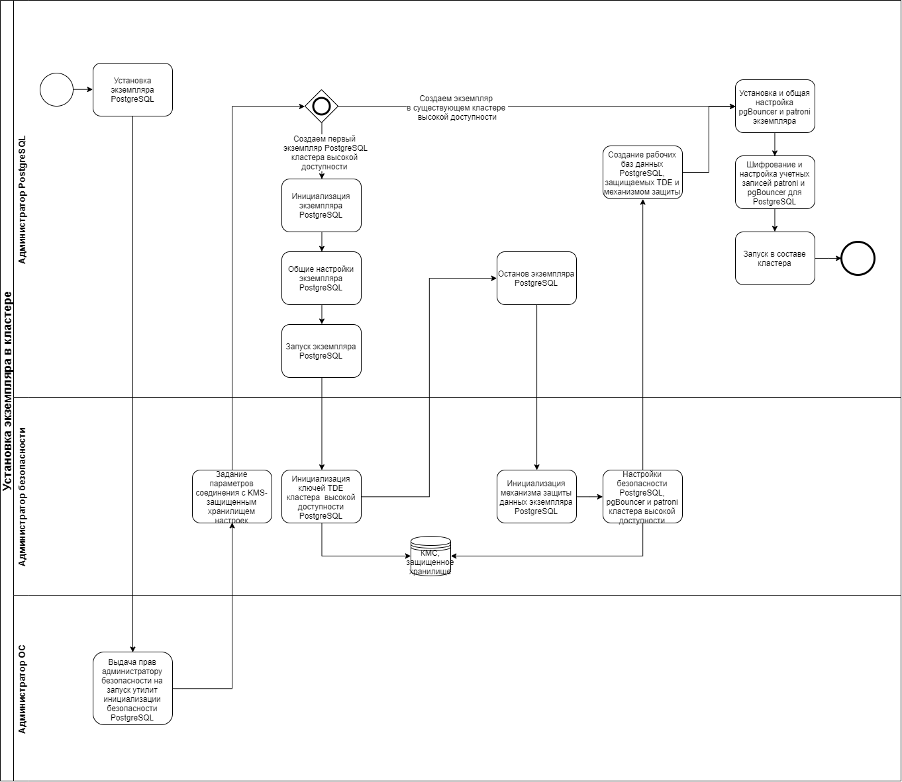

##### Создание и настройка учетной записи администратора безопасности PostgreSQL

Первая учетная запись администратора безопасности создается при инициализации механизма защиты:

1.  Администратор операционной системы создает учетную запись пользователя операционной системы.
2.  Администратор операционной системы наделяет созданного пользователя правами на запуск утилиты инициализации механизма защиты `initprotection`.
3.  Администратор безопасности заходит в систему как пользователь с правами на запуск утилиты `initprotection` и запускает ее.
4.  Утилита запрашивает логин и пароль и создает новую учетную запись администратора безопасности с указанными логином и паролем.

В дальнейшем создание и настройка учетной записи администратора безопасности PostgreSQL выполняются администратором PostgreSQL и администратором безопасности.

1.  Администратор PostgreSQL создает учетную запись администратора безопасности в PostgreSQL, задавая логин и пароль для подключения.
2.  Администратор PostgreSQL выдает созданной учетной записи минимально необходимые права: общие права на подключение, вызов функций управления каталогом безопасности и доступ к общему системному каталогу.
3.  Администратор безопасности (владелец создаваемой учетной записи) подключается к PostgreSQL с заданными администратором PostgreSQL логином и паролем и производит замену пароля на новый, известный только ему.
4.  Администратор безопасности (не владелец создаваемой записи) создает и применяет политики защиты данных, разрешающие доступ к роли и к функциям администратора безопасности для создаваемой учетной записи администратора безопасности, с помощью функции `pm_grant_security_admin`.
5.  Администратор безопасности (не владелец создаваемой записи) помещает объект БД – роль создаваемой учетной записи администратора безопасности – под защиту механизма защиты данных.

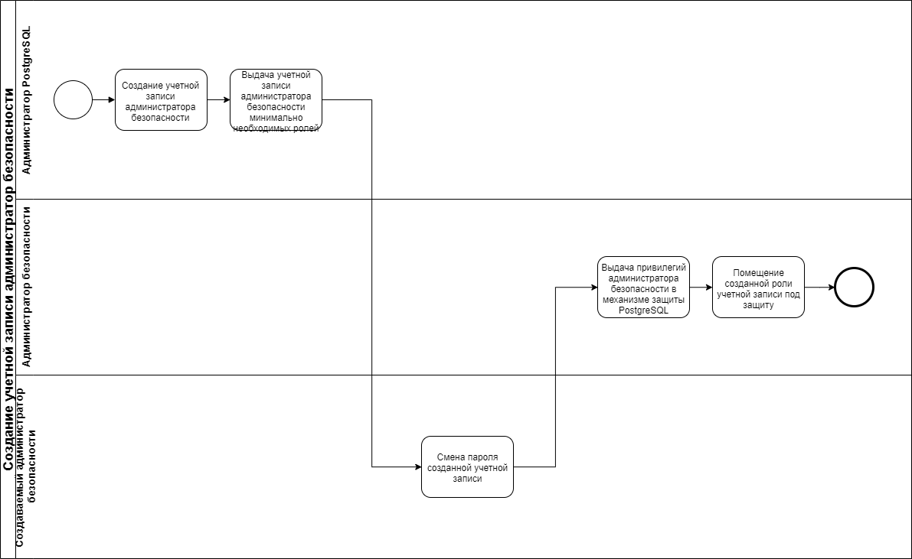

##### Удаление учетной записи администратора безопасности PostgreSQL

Администратор PostgreSQL и администратор безопасности могут инициировать удаление учетной записи пользователя из системы. При этом администратор PostgreSQL не может удалить учетную запись пользователя, которая находится под защитой механизма защиты данных (например, администратора) – этот процесс может запустить только администратор безопасности.

Удаление учетной записи происходит следующим образом:

1.  Администратор безопасности изымает привилегии администратора безопасности у удаляемой учетной записи.
2.  Администратор безопасности исключает роль удаляемой учетной записи из-под защиты.
3.  Администратор PostgreSQL удаляет учетную запись из PostgreSQL.

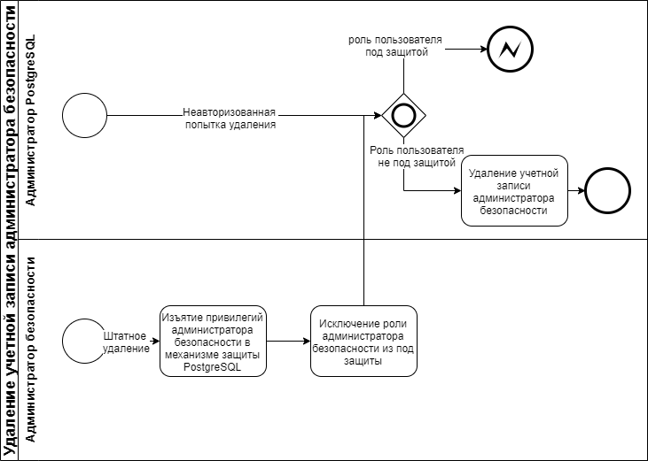

##### Создание политики защиты в PostgreSQL

Политика защиты в PostgreSQL создается и наполняется разрешениями на действия над защищенными объектами БД администратором безопасности.

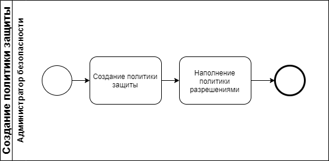

##### Создание и настройка технической учетной записи приложения в PostgreSQL через политику

Для управления доступом приложений к PostgreSQL используются технические учетные записи (ТУЗ). Они создаются и настраиваются следующим образом:

1.  Администратор PostgreSQL создает ТУЗ и задает исходные логин и пароль.
2.  Администратор PostgreSQL выдает ТУЗ необходимые роли и разрешения на доступ к объектам БД в рамках системы прав PostgreSQL.
3.  Владелец ТУЗ меняет пароль учетной записи.
4.  Администратор безопасности указывает необходимость двухфакторной аутентификации для ТУЗ в `pg_hba.conf` в защищенном хранилище.
5.  Администратор безопасности назначает ТУЗ ранее созданную политику с необходимыми приложению разрешениями.
6.  Администратор безопасности помещает объект роли ТУЗ под защиту механизма защиты данных.

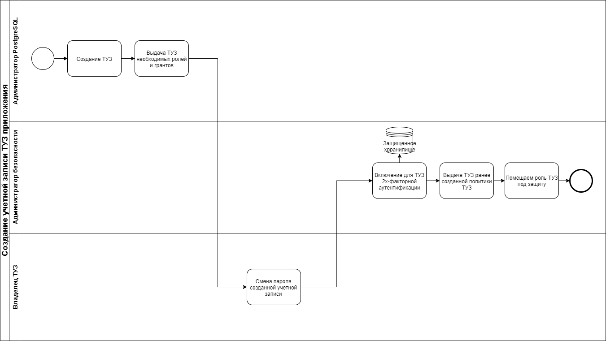

##### Изъятие привилегий учетной записи ТУЗ приложения, выданных через политику, в PostgreSQL

Изъятие политики доступа ТУЗ осуществляется администратором безопасности.

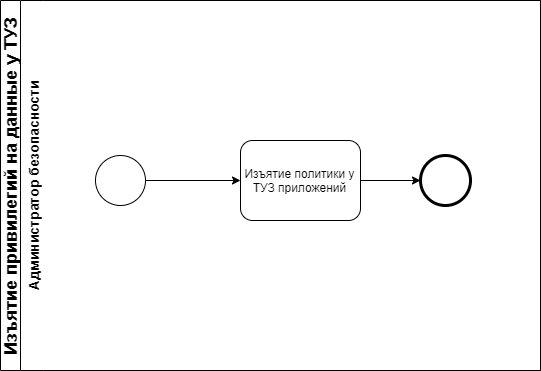

##### Удаление политики защиты в PostgreSQL

Удаление политик механизма защиты данных выполняется администратором безопасности. Политики данных, связанные хотя бы с одной учетной записью, удалить невозможно.

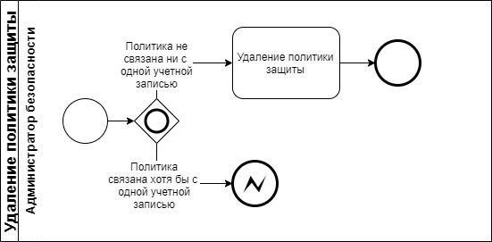

##### Удаление технической учетной записи приложения в PostgreSQL

Удаление ТУЗ выполняется администратором базы данных. Администратор базы данных не может самостоятельно удалить ТУЗ, находящиеся под защитой: для того, чтобы их удалить, администратор безопасности должен вывести эти ТУЗ из-под механизма защиты данных.

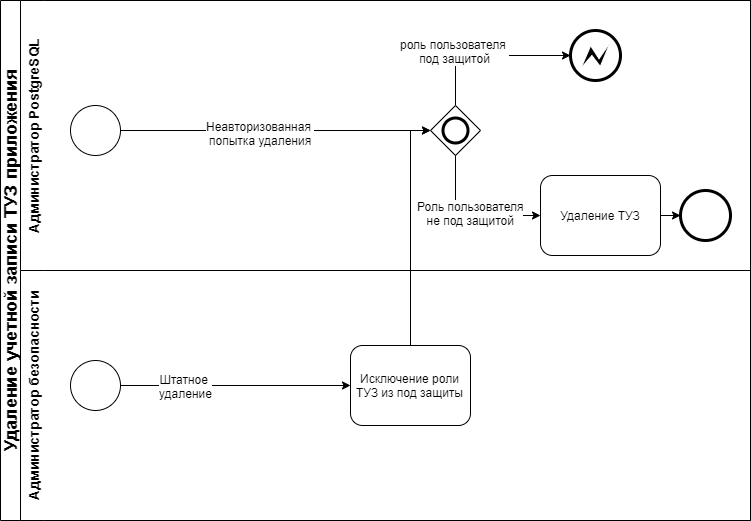

##### Изменение пароля защищаемой учетной записи в PostgreSQL

Администратор безопасности может изменить пароль своей учетной записи самостоятельно без дополнительных шагов.

Администратор PostgreSQL не может самостоятельно изменить пароль учетной записи, находящейся под защитой.

Если владелец технической учетной записи хочет изменить ее пароль, выполняются следующие шаги:

1.  Владелец ТУЗ или администратор безопасности инициирует процесс изменения пароля.

2.  Администратор безопасности снимает политики, дающие учетной записи доступ к защищаемым данным.

3.  Администратор безопасности изменяет `pg_hba.conf` в защищенном хранилище, отключая требование двухфакторной аутентификации для учетной записи.

4.  Администратор безопасности исключает роль учетной записи из-под защиты механизма защиты данных.

5.  Владелец ТУЗ устанавливает новый пароль:

    1.  Если изменение пароля ТУЗ было инициировано администратором безопасности, то сначала новый пароль устанавливает администратор PostgreSQL, затем – владелец ТУЗ.

6.  Администратор безопасности изменяет `pg_hba.conf` в защищенном хранилище, включая требование двухфакторной аутентификации для учетной записи.

7.  Администратор безопасности помещает роль учетной записи под защиту механизма защиты данных.

8.  Администратор безопасности назначает политики, дающие учетной записи доступ к защищаемым данным.

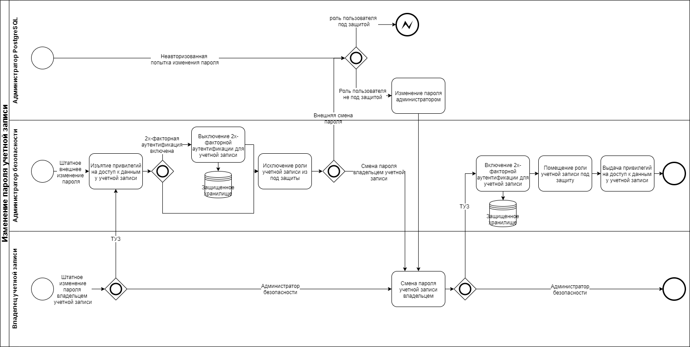

##### Помещение объектов БД PostgreSQL под защиту

Объекты базы данных помещаются под защиту администратором безопасности.

При этом новые объекты базы данных могут создаваться только администратором PostgreSQL.

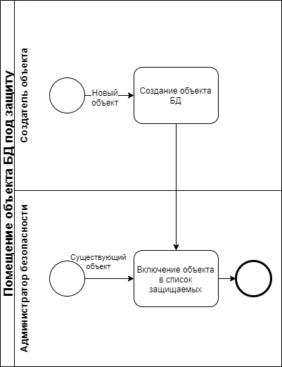

##### Изъятие объектов БД PostgreSQL из-под защиты

Изъятие объектов базы данных из-под защиты осуществляется администратором безопасности. При этом администратор безопасности может также выключить все разрешения доступа к объекту.

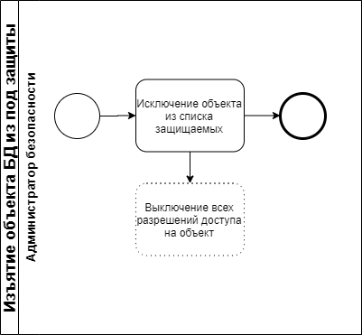

##### Доступ к данным, содержащимся в защищаемых объектах БД PostgreSQL

Доступ к защищаемым объектам базы данных осуществляется по следующему алгоритму:

1.  Поступает запрос на обращение к объекту базы данных.

2.  Если объект базы данных находится под защитой, выполняется проверка разрешений на доступ к этому объекту.

    1.  Если объект базы данных не находится под защитой, возвращается результат запроса.

3.  Если запрос соответствует хотя бы одному разрешению , возвращается результат запроса.

    1.  Если запрос не соответствует ни одному разрешению, возвращается ошибка.


#### Прозрачное шифрование данных, включая интеграцию с системами класса key management для хранения мастер-ключей

##### Первоначальная настройка шифрования для сервера СУБД PostgreSQL

Алгоритм первоначальной настройки шифрования выглядит следующим образом:

1.  Администратор БД выводит с ервер PostgreSQL из обслуживания приложений и при необходимости останавливает СУБД.

2.  Администратор БД устанавливает параметр `is_tde_on = on` в файле `postgresql.conf`.

3.  Сотрудник ИБ запускает утилиту `setup\_kms\_credentials` и создает файл с параметрами соединения с KMS.

    1.  На этом этапе подключается модуль шифрования и задается размер ключа. Настройка размера ключа описана в разделе Конфигурация.

4.  При необходимости сотрудник ИБ устанавливает мастер-ключ в KMS вручную.

    1.  Если мастер-ключ не задан, используется мастер-ключ, автоматически созданный при первом старте БД.

5.  Сервер PostgreSQL перезапускается (или запускается, если был остановлен на шаге 1) и возвращается в работу.

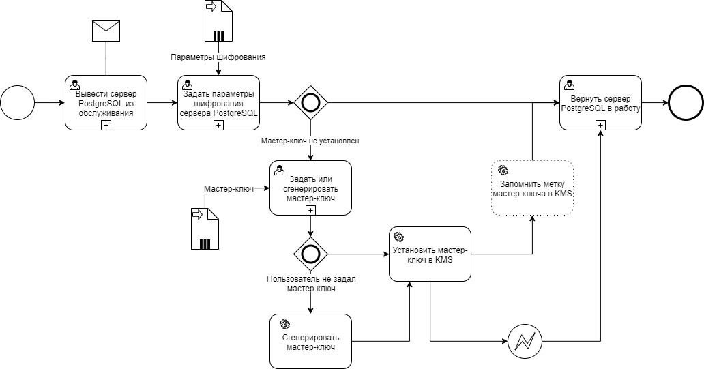

##### Смена мастер-ключа шифрования

Смена мастер-ключа шифрования происходит следующим образом:

1.  Сотрудник ИБ инициирует процесс установки нового мастер-ключа шифрования БД в KMS.

    1.  Если новый мастер-ключ не был указан, то он генерируется автоматически.

2.  Новый мастер-ключ устанавливается в KMS.

3.  Резервная копия предыдущего мастер-ключа сохраняется в KMS для использования в процедурах восстановления данных.

4.  Метка мастер-ключа устанавливается в KMS.

5.  Ключи шифрования перешифровываются новым ключом.

Возможна ситуация, когда на KMS устанавливается новый ключ без использования функций управления ключами БД. В результате ключи шифрования оказываются зашифрованы на устаревшем мастер-ключе. Для шифрования ключей на новом мастер-ключе из KMS существует процедура перешифрования ключей. В рамках этой процедуры ключи сначала расшифровываются на предыдущем мастер-ключе, затем зашифровываются на новом. Эта функция может быть инициирована администратором БД вручную или системой автоматически.

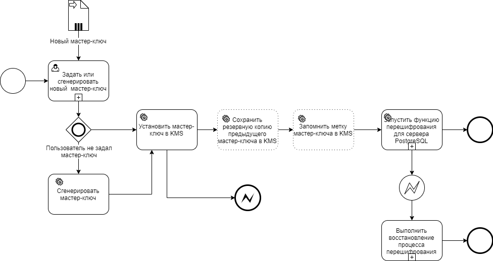

##### Восстановление шифрования при сбое процесса перешифрования ключей

При сбое процесса перешифрования ключей выполняется алгоритм восстановления шифрования. Он выглядит следующим образом:

1.  Система или администратор БД инициируют восстановление шифрования.

2.  Из KMS выгружаются актуальный и предыдущие мастер-ключи.

    Мастер-ключи выгружаются в следующем порядке:

    -   по локальной метке текущего мастер-ключа;
    -   по локальной метке предыдущего мастер-ключа (если существует);
    -   по метке текущего мастер-ключа в KMS;
    -   по метке предыдущего мастер-ключа в KMS (если существует).

3.  Ключи шифрования расшифровываются. Для расшифровки ключей шифрования мастер-ключи применяются в том же порядке, в котором они выгружались. Если ключи шифрования не удалось расшифровать ни одним из извлеченных ключей, система выдает ошибку "Не найден подходящий мастер-ключ".

4.  Ключи шифрования, зашифрованные предыдущим мастер-ключом, перешифровываются с использованием актуального мастер-ключа. Ключи шифрования, уже зашифрованные актуальным мастер-ключом, остаются без изменений.

Если ключи шифрования повреждены, то системный каталог ключей шифрования восстанавливается из резервной копии.

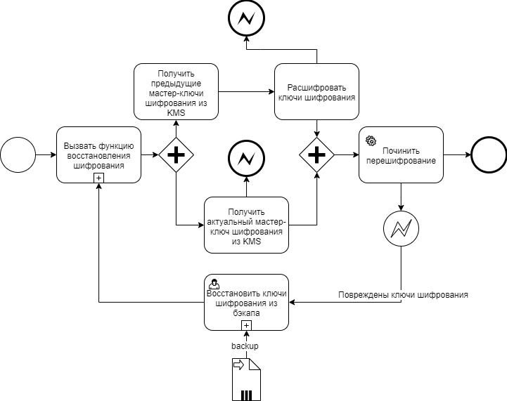

##### Шифрование БД и объектов БД

Шифрование базы данных и объектов базы данных происходит по следующему алгоритму:

1.  Администратор БД создает зашифрованное табличное пространство, которое будет использоваться создаваемой шифруемой БД по умолчанию.Для создаваемого табличного пространства автоматически создается ключ шифрования.
2.  Если необходимо отдельное зашифрованное временное табличное пространство , администратор БД создает его. Для временного табличного пространства автоматически создается ключ шифрования.
3.  Если необходимо отдельное зашифрованное табличное пространство для данных, администратор БД создает его. Для этого табличного пространства автоматически создается ключ шифрования.
4.  Администратор БД создает шифруемую базу данных, размещаемую в одном из созданных табличных пространств. При этом создаются отношения системного каталога БД и для них автоматически генерируются ключи шифрования.
5.  Администратор создает объекты базы данных с указанием табличных пространств для их размещения или с размещением в табличном пространстве по умолчанию для этой БД . Для создаваемых отношений БД автоматически генерируются ключи шифрования.

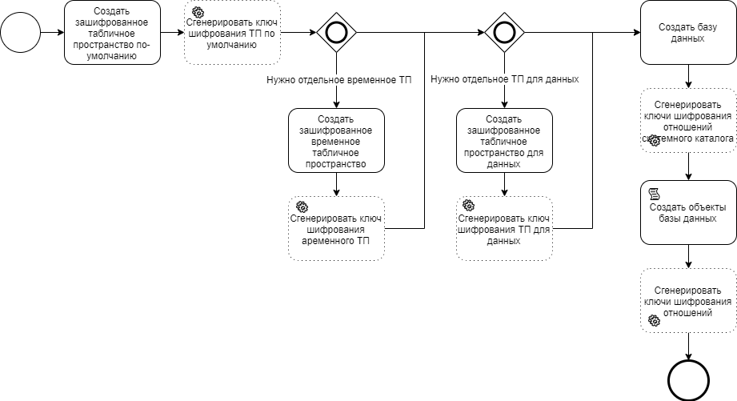

##### Создание резервной копии БД, содержащей зашифрованные данные

Создание резервной копии БД с зашифрованными данными происходит следующим образом:

1.  Администратор БД запускает процедуру создания резервной копии.

    1.  Если необходим бинарный файл резервной копии БД, содержащий зашифрованные данные, зашифрованный файл ключей шифрования и метку актуального мастер-ключа, то выполняется выгрузка бинарной резервной копии.
    2.  Если необходим SQL-скрипт заполнения БД без шифрованных данных, то выгружается такой скрипт. Сейчас для этого используются утилиты `pg_dump` и `pg_dumpall` .

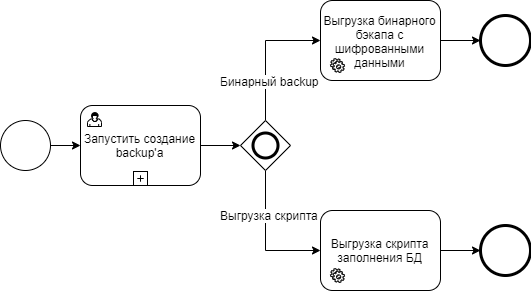

##### Восстановление из бинарной резервной копии БД

Восстановление из бинарного файла резервной копии БД происходит по следующему алгоритму:

1.  Администратор БД выводит сервер PostgreSQL из обслуживания приложений и останавливает СУБД.
2.  Администратор БД очищает каталог с данными БД (PGDATA).
3.  Администратор БД запускает утилиту восстановления БД из резервной копии. При этом указывается файл резервной копии, содержащий зашифрованные данные, системный каталог с зашифрованными ключами шифрования и метку мастер-ключа, актуального на момент создания резервной копии.
4.  По завершении восстановления администратор запускает экземпляр СУБД PostgreSQL.
5.  PostgreSQL извлекает информацию о метке мастер-ключа, актуального на момент создания резервной копии.
6.  По этой метке PostgreSQL запрашивает из KMS мастер-ключ, актуальный на момент создания резервной копии.
7.  PostgreSQL запрашивает из KMS актуальный мастер-ключ.
8.  PostgreSQL выгружает ключи шифрования из резервной копии.
9.  Если мастер-ключ резервной копии и актуальный мастер-ключ не совпадают, PostgreSQL перешифровывает ключи шифрования из резервной копии.
10. PostgreSQL запускается в штатном режиме.
11. Администратор PostgreSQL возвращает СУБД в обслуживание приложений.

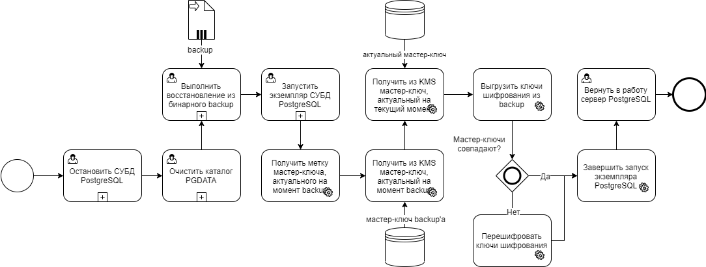

##### Репликация между серверами PostgreSQL, содержащими зашифрованные данные

Репликация между серверами PostgreSQL, содержащими зашифрованные данные, происходит следующим образом:

1.  В результате запроса к главному серверу PostgreSQL на нем происходит изменение данных.
2.  Запись об изменениях на главном сервере PostgreSQL заносится в WAL в зашифрованном виде.
3.  Выполняется репликация содержимого файла WAL. Репликация может быть потоковой и логической. Тип репликации выбирает администратор БД.

Потоковая репликация:

1.  Блоки с изменениями из зашифрованного файла WAL передаются на реплику.

2.  На реплике блоки принимаются и записываются в файл WAL.

3.  Файл WAL расшифровывается с помощью ключа шифрования из KMS.

    1.  Если файл WAL удалось расшифровать, изменения из него применяются.

    2.  Если файл WAL не удалось расшифровать, система пытается найти нужную запись в архиве и применить ее.

        1.  Если запись найдена, она применяется.
        2.  Если запись не найдена или архивирование не настроено, система снова пытается расшифровать WAL.

Логическая репликация:

1.  Из зашифрованного журнала WAL главного сервера считываются изменения в зашифрованном виде.
2.  Изменения расшифровываются ключом WAL.
3.  Расшифрованные изменения декодируются и преобразуются в сообщения формата `CopyEncryptedData.`
4.  Сообщения формата `CopyEncryptedData` шифруются ключом WAL.
5.  Зашифрованные сообщения `CopyEncryptedData` отправляются на реплики в соответствии с подписками.
6.  Принятые сообщения расшифровываются ключом шифрования WAL.
7.  Из расшифрованных сообщений извлекаются записи изменений WAL.
8.  Извлеченные записи изменений применяются к реплике.
9.  Примененные изменения записываются в WAL реплики.

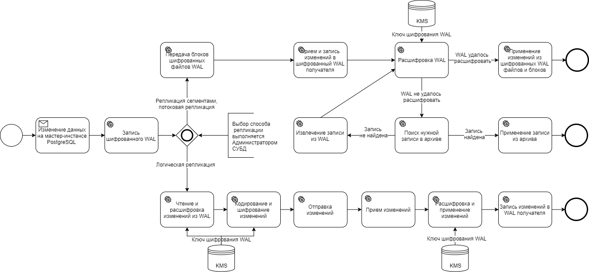

### Механизмы безопасности

#### Регистрация событий безопасности

Для регистрации событий безопасности используется доработанное расширение `pgaudit`. Настройка событий, подлежащих регистрации в системе аудита, выполняется согласно стандартной документации [pgaudit](https://github.com/pgaudit/pgaudit/blob/master/README.md).

Перечень классов событий для занесения в журнал аудита определяется переменной `pgaudit.log`. В Pangolin реализованы два дополнительных класса событий: `CONNECTION` и `PROTECTION`.

-   `CONNECTION`: События, связанные с подключением к серверу. Существуют 4 типа таких событий: `OPEN`, `CLOSED`, `FAILED`, `CHANGE USER`. Событие `FAILED` регистрируется в случае неудачной попытки аутентификации по паролю и независимо от значения `pgaudit.log`;
-   `PROTECTION`: Функции настройки механизма защиты от привилегированных пользователей.

#### Формат записей в журнале аудита

Записи аудита записываются в стандартное средство ведения журнала, начинаются с метки `AUDIT:` и содержат следующие столбцы в формате CSV. Выходные данные соответствуют формату CSV только в том случае, если префикс строки журнала каждой записи удален.

-   **AUDIT\_TYPE** - SESSION или OBJECT;
-   **STATEMENT\_ID** - Уникальный идентификатор оператора для этой сессии. Каждый идентификатор оператора представляет собой внутренний вызов. Идентификаторы операторов идут последовательно, даже если некоторые операторы не регистрируются. Когда регистрируется более одного отношения, для одного идентификатора оператора может быть несколько записей;
-   **SUBSTATEMENT\_ID** - Последовательный идентификатор для каждого вложенного оператора в основном операторе. Например, вызов функции из запроса. Идентификаторы вложенных операторов идут последовательно, даже если некоторые вложенные операторы не регистрируются. Когда регистрируется более одного отношения, для одного идентификатора вложенного оператора может быть несколько записей;
-   **CLASS** - READ, ROLE и т.д;
-   **COMMAND** - ALTER TABLE, SELECT и т.д;
-   **OBJECT\_TYPE** - TABLE, INDEX, VIEW и т.д. Применимо для SELECT, DML и большинства DDL;
-   **OBJECT\_NAME** - Полное имя объекта (например, public.account). Применимо для SELECT, DML и большинства DDL;
-   **STATEMENT** - Операция, выполняемая на сервере;
-   **PARAMETER** - Если параметр pgaudit.log\_parameter включен, здесь в кавычках будут перечислены параметры в формате CSV. Если параметров нет, здесь будет &lt;none&gt;. Иначе в этом поле будет запись &lt;not logged&gt;;
-   **EXECUTION\_RESULT** - Если операция завершается с ошибкой, вызванной недостаточными привилегиями или механизмом защиты от привилегированных пользователей, в этом поле будет запись ERROR: INSUFFICIENT PRIVILEGE. Если операция выполнена успешно и оператор принадлежит к классу PROTECTION, в поле заносится запись SUCCESS.

У записей класса `CONNECTION` собственный формат.

-   **AUDIT\_TYPE** - Всегда SESSION;
-   **CLASS** - Всегда CONNECTION;
-   **EVENT** - OPEN, CLOSED, FAILED, CHANGE USER;
-   **SESSION\_TIME** - Только для события CLOSED. Формат записи: "session time: %d:%02d:%02d.%03d" - часы, минуты, секунды, миллисекунды соответственно;
-   **DATA\_BASE** - Имя базы данных, к которой осуществляется подключение. Формат записи: - "database = %s" (имя базы данных);
-   **USER** - Имя пользователя, подключающегося к базе данных. Формат записи: - "user = %s" (имя пользователя).

Для добавления любых других полей, необходимых для удовлетворения ваших требований к журналу аудита, может использоваться префикс строки журнала ([log\_line\_prefix](http://www.postgresql.org/docs/11/static/runtime-config-logging.html#GUC-LOG-LINE-PREFIX)). Пример префикса строки журнала: "%m %u %d \[%p\]:" - включить дату/время, имя пользователя, имя базы данных и идентификатор процесса для каждой записи журнала аудита.

*Пример 1*

Защита включена, пользователь `sec_admin` выполняет `select pm_get_policies();`

```SQL
AUDIT: SESSION,2,1,READ,SELECT,,,select pm_get_policies();,<not logged>
AUDIT: SESSION,2,2,PROTECTION,EXECUTE,FUNCTION,pg_catalog.pm_get_policies,select pm_get_policies();,<not logged>
AUDIT: SESSION,2,2,PROTECTION,EXECUTE,FUNCTION,pg_catalog.pm_get_policies,select pm_get_policies();,<not logged>,SUCCESS
```

*Пример 2*

Защита включена, `select pm_get_policies();` выполняет пользователь без соответствующих прав

```SQL
AUDIT: SESSION,2,1,READ,SELECT,,,select pm_get_policies();,<not logged>
AUDIT: SESSION,2,2,PROTECTION,EXECUTE,FUNCTION,pg_catalog.pm_get_policies,select pm_get_policies();,<not logged>
AUDIT: SESSION,2,2,PROTECTION,EXECUTE,FUNCTION,pg_catalog.pm_get_policies,select pm_get_policies();,<not logged>,ERROR: INSUFFICIENT PRIVILEGE
```

*Пример 3*

`select pm_get_policies();` выполняется с отказом по любой другой причине

```SQL
AUDIT: SESSION,2,1,READ,SELECT,,,select pm_get_policies();,<not logged>
AUDIT: SESSION,2,2,PROTECTION,EXECUTE,FUNCTION,pg_catalog.pm_get_policies,select pm_get_policies();,<not logged>
```

#### Автоматическое завершение неактивных соединений

Соединения, остающиеся неактивными определенное время, подлежат принудительному завершению.

Для завершения таких соединений используется фоновый процесс, осуществляющий мониторинг и завершение бездействующих клиентских сеансов. Этот процесс запускается при старте сервера Pangolin и завершается вместе с остановкой сервера.

Процесс регулируется двумя параметрами:

-   `check_idle_time_delay` - интервал мониторинга в миллисекундах;
-   `backend_idle_alive_time` - допустимое время бездействия в секундах.

Если хотя бы один из этих параметров равен нулю, неактивные соединения завершаться не будут.

#### Рекомендации по безопасности

В этом разделе приведены рекомендации по безопасному использованию системы.

##### Защита аутентификационной информации

В Pangolin реализована защита аутетификационной информации в процессе ее ввода.При аутентификации через утилиту `psql` вводимые пользователем символы пароля не отображаются.

Перечисленные ниже способы аутентификации передают аутентификационную информацию в открытом виде:

-   файл `pgpass`;
-   строки параметров подключения (Connection string);
-   переменная окружения `PGPASSWORD`.

Эти способы аутентификации использовать не рекомендуется.

## Прочие поведенческие механизмы

### Парольные политики

Механизм управления парольными политиками расширяет стандартный механизм аутентификации и смены пароля, а также добавляет механизм парольных политик для роли. Парольная политика – правило, регулирующее создание, использование и проверку паролей.

Правило состоит из настроек для пароля, применяемых утилит и алгоритма, используемого для проверки пароля. Правило хранится в таблице `pg_pp_policy`.

Механизм управления парольными политиками использует поле `pg_authid.oid` для связи роли и парольной политики.

#### Функциональные возможности

-   расширение функциональности авторизации и смены пароля роли в части проверки пароля;

-   хранение истории паролей роли;

-   сбор и хранение статистической информации о пароле роли;

-   назначение роли парольной политики;

-   управление парольной политикой:

    -   создание, удаление и изменение политики;
    -   активация и деактивация политики;
    -   создание, удаление и изменение алгоритма проверки пароля.

#### Зависимости

Для работы механизма необходимы:

-   библиотека OpenSSL;
-   пакет cracklib (см. «Пакет cracklib»);
-   утилита проверки сложности пароля zxcvbn (см. «Библиотека zxcvbn»).

> Указанное ПО включено в дистрибутив Pangolin.

#### Объекты, добавляемые или изменяемые механизмом

Добавляются таблицы:

-   историческая таблица ранее использованных паролей (pg\_pp\_history);
-   таблица со статистической информации о текущем пароле (pg\_pp\_password);
-   таблица с парольными политиками (pg\_pp\_policy).

Добавляются PL/pgSQL функции:

-   создание или изменение парольной политики;
-   активация парольной политики;
-   деактивация парольной политики;
-   вывод парольной политики, примененной для пользователя или роли;
-   вывод детализированной информации по примененной парольной политике для пользователя или роли;
-   вывод всех политик;
-   разблокировка пользователя или роли.

Добавляются новые настроечные параметры в файл postgresql.conf.

#### Процессы механизма

##### Аутентификация по паролю

1.  От пользователя получен запрос на аутентификацию по паролю.

2.  PostgreSQL проверяет, что пользователь существует и введён правильный пароль.

3.  Вычисление парольной политики по идентификатору пользователя (pg\_authid.oid):

    -   если парольная политика найдена – применение и переход к шагу 4;
    -   если парольная политика не найдена – переход к шагу 5.

4.  Проверка пароля по найденной парольной политике:

    -   успешно – переходт к шагу 5;
    -   не успешно – отмена запроса с ошибкой аутентификации.

    > Данные по аутентификации пишутся в кэш или в файл, не в базу данных.

    Если статус аутентификации отрицательный - запись события.

    Если статус аутентификации положительный - проверка, нужно ли изменить статус на отрицательный согласно политике.

5.  Проверка необходимости сообщить пользователю о скором истечении пароля:

    -   если нужно – выводится сообщение пользователю, аутентификация завершается успешно;
    -   иначе – аутентификация завершается успешно.

    > Данные по аутентификации пишутся в кэш или в файл, не в базу данных.

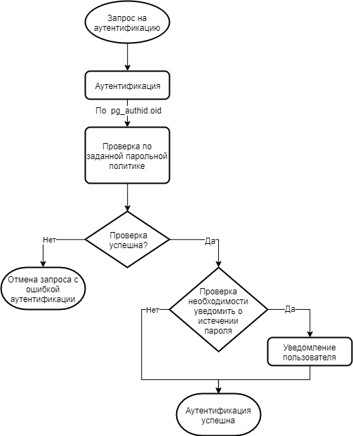

##### Создание или изменение изменение роли

1.  От пользователя получен запрос на создание или изменение роли.

2.  PostgreSQL проверяет, что пользователь существует и введён правильный пароль.

3.  Вычисление парольной политики по идентификатору пользователя (pg\_authid.oid):

    -   если парольная политика найдена – применение и переход к шагу 4;
    -   если парольная политика не найдена – нотифицирование пользователя об успешном изменении.

4.  Проверка пароля по найденной парольной политике:

    -   успешно – нотифицирование пользователя об успешном изменении;
    -   не успешно – отмена запроса с ошибкой.

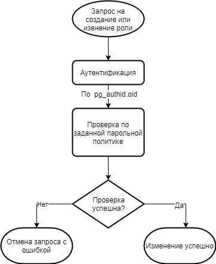

###### Вычисление значений настроек для парольной политики пользователя

Задача вычисления парольной политики пользователя сводится к заполнению всех полей таблицы pg\_pp\_policy, за исключением поля roloid:

1.  Из таблицы pg\_pp\_policy собираются все заданные настройки (значение не NULL) по идентификатору пользователя.

2.  Ищутся все роли, в которые входит данный пользователь.

3.  Для каждой найденной роли по идентификатору роли из таблицы pg\_pp\_policy выбираются настройки по условию:

    -   настройка не была выбрана на шаге 1;
    -   значение настройки не NULL.

    > Исключение – все заданные значения параметра customfunction сохраняются с сохранением порядка, формируя список функций на выполнение. Указанные функции будут последовательно применены в указанном параметре.

4.  Если на шаге 3 для одной настройки было найдено несколько значений, то выбирается наиболее строгое ограничение. В таблице ниже указаны параметры и способ определения строгости значения:

     <table>
       <thead>
         <tr>
           <th>Больше –   строже</th>
           <th>Меньше – строже</th>
         </tr>
       </thead>
       <tbody>
         <tr>
           <td>
             <ol>
               <li>reusetime</li>
               <li>inhistory</li>
               <li>minage</li>
               <li>expirewarning</li>
               <li>lockoutduration</li>
               <li>failurecountinterval</li>
               <li>minlength</li>
               <li>alphanumeric</li>
               <li>minalphachars</li>
               <li>minspecialchars</li>
               <li>minuppercase</li>
               <li>minlowercase</li>
               <li>passwordstrengthestimatorscore</li>
             </ol>
           </td>
           <td>
             <ol>
               <li>maxage</li>
               <li>graceloginlimit</li>
               <li>gracelogintimelimit</li>
               <li>maxfailure</li>
               <li>maxrptchars</li>
               <li>maxinactivity</li>
             </ol>
           </td>
         </tr>
       </tbody>
     </table>

5.  Если password\_policy.deny\_default=off, то:

    1.  Настройки, которые остались не заданы, заполняются значениями параметров из файла postgresql.conf.
    2.  Настройки, которые остались не заданы, заполняются значениями по умолчанию для параметров из файла postgresql.conf.

6.  Производится проверка на взаимозависимость настроек:

     <table>
       <thead>
         <tr>
           <th>Настройка</th>
           <th>Условие, при котором не работают зависимые настройки</th>
           <th>Зависимые настройки</th>
         </tr>
       </thead>
       <tbody>
         <tr>
           <td>policyenabled</td>
           <td>= false</td>
           <td>Все остальные</td>
         </tr>
         <tr>
           <td>reusetime</td>
           <td>> 0</td>
           <td>inhistory</td>
         </tr>
         <tr>
           <td>maxage</td>
           <td>
             <p>= NULL</p>
             <p>= 0</p>
           </td>
           <td>
             <p>graceloginlimit</p>
             <p>gracelogintimelimit</p>
             <p>expirewarning</p>
           </td>
         </tr>
         <tr>
           <td>lockout</td>
           <td>
             <p>= NULL</p>
             <p>= false</p>
           </td>
           <td>
             <p>lockoutduration</p>
             <p>maxfailure</p>
             <p>failurecountinterval</p>
           </td>
         </tr>
         <tr>
           <td>checksyntax</td>
           <td>
             <p>= NULL</p>
             <p>= false</p>
           </td>
           <td>
             <p>minlength</p>
             <p>alphanumeric</p>
             <p>minalphachars</p>
             <p>minspecialchars</p>
             <p>minuppercase</p>
             <p>minlowercase</p>
             <p>maxrptchars</p>
           </td>
         </tr>
         <tr>
           <td>tracklogin</td>
           <td>
             <p>= NULL</p>
             <p>= false</p>
           </td>
           <td>maxinactivity/td>
         </tr>
         <tr>
           <td>usepasswordstrengthestimator</td>
           <td>
             <p>= NULL</p>
             <p>= false</p>
           </td>
           <td>passwordstrengthestimatorscore</td>
         </tr>
       </tbody>
     </table>

7.  Если password\_policy.deny\_default=on, то проверяется, что заданы все обязательные настройки.

#### Таблицы

В системе управления ролями используются следующие таблицы:

##### pg\_pp\_history

Таблица ранее использованных паролей.

<table>
  <tbody>
    <tr>
      <th>
        <p>Название колонки</p>
      </th>
      <th>
        <p>Тип</p>
      </th>
      <th>
        <p>Характеристика (P – primary key</br>F – foreign key</br>U – unique</br>N – not null)</p>
      </th>
      <th>
        <p>Примечание</p>
      </th>
    </tr>
    <tr>
      <td>
        <p>roloid</p>
      </td>
      <td>
        <p>regrole</p>
      </td>
      <td>
        <p>PN</p>
      </td>
      <td>
        <p>Идентификатор роли. Соответствует полю pg_authid.oid.</p>
      </td>
    </tr>
    <tr>
      <td>
        <p>password</p>
      </td>
      <td>
        <p>text</p>
      </td>
      <td>
        <p>PN</p>
      </td>
      <td>
        <p>Хэш пароля (хэш поля pg_authid. rolpassword)</p>
      </td>
    </tr>
    <tr>
      <td>
        <p>lastsuccesstime</p>
      </td>
      <td>
        <p>timestamptz</p>
      </td>
      <td>
        <p>N</p>
      </td>
      <td>
        <p>Время последнего успешного входа в систему с использованием этого пароля</p>
      </td>
    </tr>
    <tr>
      <td>
        <p>createtime</p>
      </td>
      <td>
        <p>timestamptz</p>
      </td>
      <td>
        <p>N</p>
      </td>
      <td>
        <p>Время создания пароля</p>
      </td>
    </tr>
    <tr>
      <td>
        <p>archivetime</p>
      </td>
      <td>
        <p>timestamptz</p>
      </td>
      <td>
        <p>PN</p>
      </td>
      <td>
        <p>Время перемещения пароля в таблицу</p>
      </td>
    </tr>
  </tbody>
</table>

##### pg\_pp\_password

Таблица информации о текущем пароле.

<table>
  <tbody>
    <tr>
      <th>
        <p>Название колонки</p>
      </th>
      <th>
        <p>Тип</p>
      </th>
      <th>
        <p>Характеристика (P – primary key</br>F – foreign key</br>U – unique</br>N – not null)</p>
      </th>
      <th>
        <p>Описание</p>
      </th>
    </tr>
    <tr>
      <td>
        <p>roloid</p>
      </td>
      <td>
        <p>regrole</p>
      </td>
      <td>
        <p>PUN</p>
      </td>
      <td>
        <p>идентификатор роли. Соответствует полю pg_authid.oid</p>
      </td>
    </tr>
    <tr>
      <td>
        <p>password</p>
      </td>
      <td>
        <p>text</p>
      </td>
      <td>
        <p>
          <br/>
        </p>
      </td>
      <td>
        <p>хэш пароля. Eсли пользователю будет установлен пустой пароль NULL – в этом нету возможности передать управление модулю</p>
      </td>
    </tr>
    <tr>
      <td>
        <p>failcounter</p>
      </td>
      <td>
        <p>integer</p>
      </td>
      <td>
        <p>N</p>
      </td>
      <td>
        <p>количество попыток входа (подряд) с использованием неверного пароля</p>
      </td>
    </tr>
    <tr>
      <td>
        <p>lastfailtime</p>
      </td>
      <td>
        <p>timestamptz</p>
      </td>
      <td>
        <p>N</p>
      </td>
      <td>
        <p>время последней неудачной попытки входа с неверным паролем</p>
      </td>
    </tr>
    <tr>
      <td>
        <p>gracesuccesscounter</p>
      </td>
      <td>
        <p>integer</p>
      </td>
      <td>
        <p>N</p>
      </td>
      <td>
        <p>счетчик удачных аутентификаций после истечения maxage</p>
      </td>
    </tr>
    <tr>
      <td>
        <p>lastsuccesstime</p>
      </td>
      <td>
        <p>timestamptz</p>
      </td>
      <td>
        <p>N</p>
      </td>
      <td>
        <p>время последней удачной авторизации с паролем</p>
      </td>
    </tr>
    <tr>
      <td>
        <p>createtime</p>
      </td>
      <td>
        <p>timestamptz</p>
      </td>
      <td>
        <p>N</p>
      </td>
      <td>
        <p>время создания текущего пароля</p>
      </td>
    </tr>
    <tr>
      <td>
        <p>unblockexpirytime</p>
      </td>
      <td>
        <p>timestamptz</p>
      </td>
      <td>
        <p>N</p>
      </td>
      <td>
        <p>время разблокировки, если роль была заблокирована в связи с неактивностью</p>
      </td>
    </tr>
  </tbody>
</table>

##### pg\_pp\_policy

Таблица парольных политик.

> Политики не имеют своего имени - для них отображается имя соответствующей роли.

<table>
  <tbody>
    <tr>
      <th>
        <p>Название колонки</p>
      </th>
      <th>
        <p>Тип</p>
      </th>
      <th>
        <p>Характеристика (P – primary key</br>F – foreign key</br>U – unique</br>N – not null)</p>
      </th>
      <th>
        <p>Описание</p>
      </th>
      <th>
        <p>Отключаемая функциональность, если значение не задано</p>
      </th>
    </tr>
    <tr>
      <td>
        <p>roloid</p>
      </td>
      <td>
        <p>regrole</p>
      </td>
      <td>
        <p>PUN</p>
      </td>
      <td>
        <p>Идентификатор роли</p>
      </td>
      <td>
        <p>-</p>
      </td>
    </tr>
    <tr>
      <td>
        <p>reusetime</p>
      </td>
      <td>
        <p>interval</p>
      </td>
      <td>
        <p>
          <br/>
        </p>
      </td>
      <td>
        <p>Время, в течение которого старый пароль сохраняется, а попытка сменить пароль на совпадающий со старым заканчивается ошибкой. Значение данного поля приоритетнее значения поля inhistory</p>
      </td>
      <td>
        <p>Изменение пароля, если не задано inhistory</p>
      </td>
    </tr>
    <tr>
      <td>
        <p>inhistory</p>
      </td>
      <td>
        <p>integer</p>
      </td>
      <td>
        <p>
          <br/>
        </p>
      </td>
      <td>
        <p>Максимальное количество сохраненных старых паролей. При достижении максимума добавление еще одного старого пароля приводит к удалению наиболее старого (по createtime) из них. Если задано reusetime, то не используется.</p>
      </td>
      <td>
        <p>Изменение пароля, если не задано reusetime</p>
      </td>
    </tr>
    <tr>
      <td>
        <p>maxage</p>
      </td>
      <td>
        <p>interval</p>
      </td>
      <td>
        <p>
          <br/>
        </p>
      </td>
      <td>
        <p>Время жизни пароля, после которого пароль считается истекшим есть поле rolvaliduntil, как с ним соотносится?</p>
      </td>
      <td>
        <p>Аутентификация</p>
      </td>
    </tr>
    <tr>
      <td>
        <p>minage</p>
      </td>
      <td>
        <p>interval</p>
      </td>
      <td>
        <p>
          <br/>
        </p>
      </td>
      <td>
        <p>Время, которое должно пройти между двумя изменениями пароля</p>
      </td>
      <td>
        <p>Изменение пароля</p>
      </td>
    </tr>
    <tr>
      <td>
        <p>graceloginlimit</p>
      </td>
      <td>
        <p>integer</p>
      </td>
      <td>
        <p>
          <br/>
        </p>
      </td>
      <td>
        <p>Максимальное количество аутентификаций, доступных роли после истечения времени жизни пароля</p>
      </td>
      <td>
        <p>Аутентификация, если пароль просрочен</p>
      </td>
    </tr>
    <tr>
      <td>
        <p>gracelogintimelimit</p>
      </td>
      <td>
        <p>interval</p>
      </td>
      <td>
        <p>
          <br/>
        </p>
      </td>
      <td>
        <p>Время после окончания действия пароля, в течение которого он продолжает работать</p>
      </td>
      <td>
        <p>Аутентификация, если пароль просрочен</p>
      </td>
    </tr>
    <tr>
      <td>
        <p>expirewarning</p>
      </td>
      <td>
        <p>interval</p>
      </td>
      <td>
        <p>
          <br/>
        </p>
      </td>
      <td>
        <p>Время до окончания действия пароля, в течение которого пользователю будет отображаться предупреждение. Предупреждение отображается в консоли PSQL после аутентификации или после коммита.</p>
      </td>
      <td>
        <p>-</p>
      </td>
    </tr>
    <tr>
      <td>
        <p>lockout</p>
      </td>
      <td>
        <p>boolean</p>
      </td>
      <td>
        <p>
          <br/>
        </p>
      </td>
      <td>
        <p>Признак включенного правила блока аккаунта в результате достижения максимума попыток входа с неверным паролем.</p>
      </td>
      <td>
        <p>Аутентификация</p>
      </td>
    </tr>
    <tr>
      <td>
        <p>lockoutduration</p>
      </td>
      <td>
        <p>interval</p>
      </td>
      <td>
        <p>
          <br/>
        </p>
      </td>
      <td>
        <p>Время, на которое блокируется аккаунт в результате достижения максимума попыток входа с неверным паролем</p>
      </td>
      <td>
        <p>Аутентификация, если lockout = true</p>
      </td>
    </tr>
    <tr>
      <td>
        <p>maxfailure</p>
      </td>
      <td>
        <p>integer</p>
      </td>
      <td>
        <p>
          <br/>
        </p>
      </td>
      <td>
        <p>Максимальное количество подряд введенных неверных паролей, при достижении которого вызывается блокировка пароля</p>
      </td>
      <td>
        <p>Аутентификация, если lockout = true</p>
      </td>
    </tr>
    <tr>
      <td>
        <p>failurecountinterval</p>
      </td>
      <td>
        <p>interval</p>
      </td>
      <td>
        <p>
          <br/>
        </p>
      </td>
      <td>
        <p>Время, после которого обнуляется кол-во неверных вводов пароля</p>
      </td>
      <td>
        <p>Аутентификация, если lockout = true</p>
      </td>
    </tr>
    <tr>
      <td>
        <p>checksyntax</p>
      </td>
      <td>
        <p>boolean</p>
      </td>
      <td>
        <p>
          <br/>
        </p>
      </td>
      <td>
        <p>Признак включенных правил синтаксической проверки пароля (если она возможно)</p>
      </td>
      <td>
        <p>Изменение пароля</p>
      </td>
    </tr>
    <tr>
      <td>
        <p>minlength</p>
      </td>
      <td>
        <p>integer</p>
      </td>
      <td>
        <p>
          <br/>
        </p>
      </td>
      <td>
        <p>Минимальная длина пароля</p>
      </td>
      <td>
        <p>Изменение пароля, если checksyntax = true)</p>
      </td>
    </tr>
    <tr>
      <td>
        <p>illegalvalues</p>
      </td>
      <td>
        <p>boolean</p>
      </td>
      <td>
        <p>
          <br/>
        </p>
      </td>
      <td>
        <p>Признак включенного правила проверке пароля по списку часто используемых (crack.h)</p>
      </td>
      <td>
        <p>Изменение пароля</p>
      </td>
    </tr>
    <tr>
      <td>
        <p>alphanumeric</p>
      </td>
      <td>
        <p>integer</p>
      </td>
      <td>
        <p>
          <br/>
        </p>
      </td>
      <td>
        <p>Минимальное количество цифр в пароле</p>
      </td>
      <td>
        <p>Изменение пароля, если checksyntax = true</p>
      </td>
    </tr>
    <tr>
      <td>
        <p>minalphachars</p>
      </td>
      <td>
        <p>integer</p>
      </td>
      <td>
        <p>
          <br/>
        </p>
      </td>
      <td>
        <p>Минимальное количество букв в пароле</p>
      </td>
      <td>
        <p>Изменение пароля, если checksyntax = true</p>
      </td>
    </tr>
    <tr>
      <td>
        <p>minspecialchars</p>
      </td>
      <td>
        <p>integer</p>
      </td>
      <td>
        <p>
          <br/>
        </p>
      </td>
      <td>
        <p>Минимальное количество специальных символов (кроме букв и цифр) в пароле</p>
      </td>
      <td>
        <p>Изменение пароля, если checksyntax = true</p>
      </td>
    </tr>
    <tr>
      <td>
        <p>minuppercase</p>
      </td>
      <td>
        <p>integer</p>
      </td>
      <td>
        <p>
          <br/>
        </p>
      </td>
      <td>
        <p>Минимальное количество прописных букв</p>
      </td>
      <td>
        <p>Изменение пароля, если checksyntax = true</p>
      </td>
    </tr>
    <tr>
      <td>
        <p>minlowercase</p>
      </td>
      <td>
        <p>integer</p>
      </td>
      <td>
        <p>
          <br/>
        </p>
      </td>
      <td>
        <p>Минимальное количество строчных букв</p>
      </td>
      <td>
        <p>Изменение пароля, если checksyntax = true</p>
      </td>
    </tr>
    <tr>
      <td>
        <p>maxrptchars</p>
      </td>
      <td>
        <p>integer</p>
      </td>
      <td>
        <p>
          <br/>
        </p>
      </td>
      <td>
        <p>Максимальное количество повторяющихся символов</p>
      </td>
      <td>
        <p>Изменение пароля, если checksyntax = true</p>
      </td>
    </tr>
    <tr>
      <td>
        <p>policyenable</p>
      </td>
      <td>
        <p>boolean</p>
      </td>
      <td>
        <p>
          <br/>
        </p>
      </td>
      <td>
        <p>Признак включенной политики</p>
      </td>
      <td>
        <p>-</p>
      </td>
    </tr>
    <tr>
      <td>
        <p>tracklogin</p>
      </td>
      <td>
        <p>boolean</p>
      </td>
      <td>
        <p>
          <br/>
        </p>
      </td>
      <td>
        <p>Запоминать ли время последней аутентификации</p>
      </td>
      <td>
        <p>Аутентификация</p>
      </td>
    </tr>
    <tr>
      <td>
        <p>maxinactivity</p>
      </td>
      <td>
        <p>interval</p>
      </td>
      <td>
        <p>
          <br/>
        </p>
      </td>
      <td>
        <p>Время после последней аутентификации, после которого роль будет заблокирована</p>
      </td>
      <td>
        <p>Аутентификация, если tracklogin = true и превышен интервал неактивности</p>
      </td>
    </tr>
    <tr>
      <td>
        <p>usepasswordstrengthestimator</p>
      </td>
      <td>
        <p>boolean</p>
      </td>
      <td>
        <p>
          <br/>
        </p>
      </td>
      <td>
        <p>Использовать библиотеку zxcvbn для проверки пароля</p>
      </td>
      <td>
        <p>Изменение пароля</p>
      </td>
    </tr>
    <tr>
      <td>
        <p>passwordstrengthestimatorscore</p>
      </td>
      <td>
        <p>integer</p>
      </td>
      <td>
        <p>
          <br/>
        </p>
      </td>
      <td>
        <p>Минимальная допустимая сложности пароля (см. «Проверка сложности пароля »)</p>
      </td>
      <td>
        <p>Изменение пароля, если usepasswordstrengthestimator = true</p>
      </td>
    </tr>
    <tr>
      <td>
        <p>customfunction</p>
      </td>
      <td>
        <p>string</p>
      </td>
      <td>
        <p>
          <br/>
        </p>
      </td>
      <td>
        <p>Название пользовательской функции проверки пароля</p>
      </td>
      <td>
        <p>Изменение пароля</p>
      </td>
    </tr>
  </tbody>
</table>

### etcd

#### Настройка `etcd`

`/lib/systemd/system/etcd.service`

```Bash
[Unit]
Description=Etcd Server
After=network.target
After=network-online.target
Wants=network-online.target

[Service]
Type=notify
WorkingDirectory=/var/lib/etcd/
EnvironmentFile=-/etc/etcd/etcd.conf
User=etcd
## set GOMAXPROCS to number of processors
ExecStart=/bin/bash -c "GOMAXPROCS=$(nproc) /usr/bin/etcd"

Restart=on-failure
LimitNOFILE=65536

[Install]
WantedBy=multi-user.target
```

`node-1 /etc/etcd/etcd.conf`

```Bash
[pprb_dev@tkle-pprb0100 ~]$ sudo cat /etc/etcd/etcd.conf | grep -v ^#
ETCD_DATA_DIR="/var/lib/etcd"
ETCD_LISTEN_PEER_URLS="http://0.0.0.0:2380"
ETCD_LISTEN_CLIENT_URLS="http://0.0.0.0:2379"
ETCD_NAME="node-01"
ETCD_HEARTBEAT_INTERVAL="1000"
ETCD_ELECTION_TIMEOUT="5000"
ETCD_INITIAL_ADVERTISE_PEER_URLS="http://${HOST_VM1}:2380"
ETCD_ADVERTISE_CLIENT_URLS="http://${HOST_VM1}:2379"
ETCD_INITIAL_CLUSTER="node-01=http://${HOST_VM1}:2380,node-02=http://${HOST_VM2}:2380,node-03=http://${HOST_VM3}:2380"
ETCD_INITIAL_CLUSTER_TOKEN="etcd-cluster"
ETCD_INITIAL_CLUSTER_STATE="new"
```

`node-02 /etc/etcd/etcd.conf`

```Bash
[pprb_dev@tkle-pprb0095 ~]$ sudo cat /etc/etcd/etcd.conf | grep -v ^#
ETCD_DATA_DIR="/var/lib/etcd"
ETCD_LISTEN_PEER_URLS="http://0.0.0.0:2380"
ETCD_LISTEN_CLIENT_URLS="http://0.0.0.0:2379"
ETCD_NAME="node-02"
ETCD_HEARTBEAT_INTERVAL="1000"
ETCD_ELECTION_TIMEOUT="5000"
ETCD_INITIAL_ADVERTISE_PEER_URLS="http://${HOST_VM2}:2380"
ETCD_ADVERTISE_CLIENT_URLS="http://${HOST_VM2}:2379"
ETCD_INITIAL_CLUSTER="node-01=http://${HOST_VM1}:2380,node-02=http://${HOST_VM2}:2380,node-03=http://${HOST_VM3}:2380"
ETCD_INITIAL_CLUSTER_TOKEN="etcd-cluster"
ETCD_INITIAL_CLUSTER_STATE="new"
```

`node-03 /etc/etcd/etcd.conf`

```Bash
[pprb_dev@tkle-pprb0081 ~]$ sudo cat /etc/etcd/etcd.conf | grep -v ^#
ETCD_DATA_DIR="/var/lib/etcd"
ETCD_LISTEN_PEER_URLS="http://0.0.0.0:2380"
ETCD_LISTEN_CLIENT_URLS="http://0.0.0.0:2379"
ETCD_NAME="node-03"
ETCD_HEARTBEAT_INTERVAL="1000"
ETCD_ELECTION_TIMEOUT="5000"
ETCD_INITIAL_ADVERTISE_PEER_URLS="http://${HOST_VM3}:2380"
ETCD_ADVERTISE_CLIENT_URLS="http://${HOST_VM3}:2379"
ETCD_INITIAL_CLUSTER="node-01=http://${HOST_VM1}:2380,node-02=http://${HOST_VM2}:2380,node-03=http://${HOST_VM3}:2380"
ETCD_INITIAL_CLUSTER_TOKEN="etcd-cluster"
ETCD_INITIAL_CLUSTER_STATE="new"
```

где

-   `--listen-peer-urls` ' http://localhost:2380 ' - список ссылок, с которых собирается трафик пиров;

-   `--listen-client-urls` ' http://localhost:2379 '- список ссылок, с которых собирается трафик пиров;

-   `--heartbeat-interval` '100' - время (мс) периода проверки (heartbeat);

-   `--election-timeout` '1000' - время (в мс) таймаута алгоритма выбора;

-   `--initial-advertise-peer-urls` ' http://localhost:2380 ' - список ссылок пиров этого элемента кластера для передачи другим элемента кластера;

-   `--advertise-client-urls` ' http://localhost:2379 ' - список ссылок клиентов этого элемента кластера для публичной передачи. Передаваемые ссылки клиентов будут доступны системам, взаимодействующим с кластером etcd.

    Клиентские библиотеки обрабатывают эти ссылки для подключения к кластеру etcd;

-   `--initial-cluster` 'default= http://localhost:2380 ' - исходная конфиугурация кластера для бутстрапинга;

-   `--initial-cluster-state` 'new' - исходное состояние кластера ('new' или 'existing');

-   `--initial-cluster-token` 'etcd-cluster' - исходный токен кластера etcd во время бутстрапа. При использовании нескольких кластеров позволяет избежать непреднамеренного взаимодействия между ними.

`Обязательно рекурсивно сменить владельца директории`

```Bash
sudo chown -R etcd:etcd /var/lib/etcd/
```

`Запустить на всех нодах`

```Bash
sudo systemctl daemon-reload
sudo systemctl start etcd.service
sudo systemctl status etcd.service
sudo journalctl -xe
```

#### Устранение неполадок

После запуска кластера возможно появление ошибки в логах `sudo journalctl -xe`:

```text
etcd[1667]: request cluster ID mismatch (got 7cea461d0dab6173 want e769641869d94218)
```

Исправляется остановкой кластера и пересозданием директории `/var/lib/etcd`:

```Bash
sudo systemctl stop etcd.service
sudo rm -rf /var/lib/etcd/
sudo mkdir /var/lib/etcd
sudo chown -R etcd:etcd /var/lib/etcd/
sudo systemctl start etcd.service
```

При ошибке типа:

```text
CRITICAL: system ID mismatch, node pg02 belongs to a different cluster: 6792170493505963560 != 6792187323051185862
```

Выполнить команду

```bash
etcdctl rm /service/clustername/initialize
```

и перезапустить patroni.

При одном запущенном patroni и сообщении типа:

```text
INFO: following a different leader because i am not the healthiest node
```

Выполнить команду

```bash
etcdctl rm /service/clustername/optime/leader
```

и перезапустить patroni.

Для быстрого просмотра проблем с кластером:

```Bash
etcdctl cluster-health
```

Для просмотра структуры хранилища:

```bash
etcdctl ls --recursive --sort -p /service/clustername
```

где `clustername` - имя кластера базы.

Для просмотра всей структуры:

```bash
etcdctl ls --recursive /
```

`Пример`

```bash
etcdctl ls -r /
/service
/service/clus
/service/clus/members
/service/clus/members/pg02
/service/clus/members/pg01
/service/clus/initialize
/service/clus/config
/service/clus/optime
/service/clus/optime/leader
/service/clus/history
/service/clus/leader
```

Для получения значения из параметра:

```bash
etcdctl -o extended get /service/clustername/leader
etcdctl -o extended get /service/clustername/members/
```

### HAProxy

HAProxy - инструмент для обеспечения высокой доступности и балансировки нагрузки для TCP и HTTP-приложений посредством распределения входящих запросов на несколько обслуживающих серверов.

### pg\_pathman

pg\_pathman - это расширение, реализующее оптимизированное решение для секционирования больших и распределённых баз данных.

Секционированием данных называется разбиение одной большой логической таблицы на несколько меньших физических секций. Секционирование может принести следующую пользу:

-   в определённых ситуациях оно кардинально увеличивает быстродействие, особенно когда большой процент часто запрашиваемых строк таблицы относится к одной или лишь нескольким секциям. Секционирование может сыграть роль ведущих столбцов в индексах, что позволит уменьшить размер индекса и увеличит вероятность нахождения наиболее востребованных частей индексов в памяти;
-   когда в выборке или изменении данных задействована большая часть одной секции, последовательное сканирование этой секции может выполняться гораздо быстрее, чем случайный доступ по индексу к данным, разбросанным по всей таблице;
-   массовую загрузку и удаление данных можно осуществлять, добавляя и удаляя секции, если это было предусмотрено при проектировании секционированных таблиц. Операция `ALTER TABLE DETACH PARTITION` или удаление отдельной секции с помощью команды `DROP TABLE` выполняются гораздо быстрее, чем массовая обработка. Эти команды также полностью исключают накладные расходы, связанные с выполнением `VACUUM` после`DELETE`;
-   редко используемые данные можно перенести на более дешёвые и медленные носители.

#### Секционирование

В PostgreSQL на данный момент есть несколько способов реализации секционирования:

-   секционирование через наследование;
-   декларативное секционирование;
-   расширения (например pg\_pathman).

В данном разделе мы в основном будем сравнивать декларативное секционирование и секционирование через pg\\pathman.

#### Секционирование с помощью pg\_pathman

Используя pg\_pathman, можно:

-   секционировать большие базы данных, не прерывая их работу;
-   ускорять выполнение запросов с секционированными таблицами;
-   управлять существующими и добавлять новые секции на лету;
-   добавлять в качестве секций сторонние таблицы;
-   соединять секционированные таблицы для операций чтения и записи.

#### Ограничения реализации

В этом разделе описываются ограничения текущей реализации pg\_pathman в Pangolin.

##### Предоставление прав на схему ext

pg\_pathman находится в схеме `ext`.

Если пользователь без прав на схему `ext` создаст таблицу и попытается выполнить над ней операцию `drop`, то запустится триггер в pg_pathman:

```SQL
CREATE EVENT TRIGGER pathman_ddl_trigger
ON sql_drop
EXECUTE PROCEDURE @extschema@.pathman_ddl_trigger_func();
```

Так как у пользователя отсутствуют права на работу со схемой `ext`, операция завершится с ошибкой.

Таким образом, все пользователи, которым необходимы права на изменение структурной части БД, должны обладать всеми правами на изменение схемы `ext`.

### pg\_cron

Расширение позволяет создавать задачи `cron`, выполняющие команды PostgreSQL в заданной БД.

#### Примеры

Удалить старые данные в субботу, 3:30 ночи:

```SQL
SELECT cron.schedule('30 3 * * 6', $$DELETE FROM events WHERE event_time < now() - interval '1 week'$$);
```

Выполнять VACUUM каждый день в 10:00 утра:

```SQL
SELECT cron.schedule('0 10 * * *', 'VACUUM');
```

Посмотреть текущие задачи:

```SQL
SELECT * FROM cron.job;
```

Отменить задачу:

```SQL
SELECT cron.unschedule(43);
```

#### Настройка

Расширение уже входит в поставку Pangolin. Для его использования необходимо:

В `postgresql.conf` прописать:

```sql
shared_preload_libraries = 'pg_cron'
cron.database_name = 'postgres'
```

где `postgres` - имя БД, в которой будет работать `cron`.

От пользователя с правами `superuser` необходимо включить расширения:

```SQL
CREATE EXTENSION pg_cron;
```

Выдать права на `cron` нужному пользователю:

```SQL
GRANT USAGE ON SCHEMA cron TO marco;
```

Так как процессу `pg_cron` необходимо создавать коннекцию к БД, в файле `.pgpass` нужно прописать имя и пароль пользователей, использующих `cron`.

#### Работа внутри кластера

`pg_cron` можно безопасно использовать в схеме с реализацией. Данные `cron` можно модифицировать только с текущего `Leader`.

> Важно:
>
> Так как `pg_cron` для выполнения задач сохраняет `host:ip` сервера (127.0.0.1:5432), необходимо на всех экземплярах выставить одинаковый порт. В противном случае при `switchover/failover` `pg_cron` попытается подключиться к старому лидеру.

### pg\_stat\_statements

Расширение `pg_stat_statements` входит в основной состав Platform V Pangolin. Это расширение осуществляет сбор статистики выполнения сервером всех запросов SQL.

#### Файл статистики

Расширение `pg_stat_statements` записывает запросы, поступающие на базу данных Pangolin, в файл статистики `$PGDATA/pg_stat_tmp/pgss_query_texts.stat`.

Параметры запросов заносятся в файл статистики в нормализованном виде. Например, запрос

```SQL
select * from test_table_1 where id=4 and str='test_data_4';
```

будет записан в файл статистики в следующем виде:

```SQL
select * from test_table_1 where id=$1 and str=$2
```

При этом если запросы DML (`select`, `update`, `delete`, `insert`) вложены в операторы утилит (все, кроме DML: `explain`, `create`, `copy` и др.), то параметры этих запросов будут записаны в файл статистики в открытом виде, например:

Запрос:

```SQL
explain analyze select * from test_table_1 where id=4 and str='test_data_4';
```

Запись в файле статистики:

```SQL
explain analyze select * from test_table_1 where id=4 and str='test_data_4'
```

Запрос:

```SQL
create table test_table_2 as select id, str from test_table_1 where id=4 and str='test_data_4'; 
```

Запись в файле статистики:

```SQL
create table test_table_2 as select id, str from test_table_1 where id=4 and str='test_data_4'
```

Запрос:

```SQL
COPY (SELECT * FROM test_table_1 where id=4 and str='test_data_4') TO STDOUT;   
```

Запись в файле статистики:

```SQL
COPY (SELECT * FROM test_table_1 where id=4 and str='test_data_4') TO STDOUT
```

Запросы такого рода использовать в системах, содержащих конфиденциальную информацию, не рекомендуется.

### Фрагментация: pg\_repack и pgcompacttable

В состав Pangolin входят утилиты по реорганизации данных:

-   расширение `pg_repack` - реорганизация таблиц без блокировки, удаление пустот в таблицах и индексах, восстановление физического порядка кластеризованных индексов. Есть переведённая документация;
-   инструмент `pgcompacttable` - скрипт `perl` для уменьшения размера "раздутых" таблиц и индексов без применения `Access Exclusive` блокировки.

#### Ситуации, при которых может возникать фрагментация

-   непредвиденный скачок запросов `UPDATE` или `DELETE`, сильно отличающийся от обычного профиля нагрузки;
-   наличие долгих транзакций, препятствующих удалению старых версий записей ( VACUUM не может удалить запись, если есть хотя бы одна незакрытая транзакция, старше записи , удалившего или изменившего эту запись);
-   наличии незавершенных PREPARED транзакций;
-   наличие открытых слотов репликации. Это может произойти из-за сильной задержки между лидером и репликой либо в случае недоступности реплики;
-   фрагментация может накапливаться естественным образом, если в таблице есть типы данных переменной длинны. Это приводит к образованию кусков удаленных данных такого размера, который сложно будет перезаписать новыми записями.

#### Сравнение утилит

<table>
  <thead>
    <tr>
      <th></th>
      <th>CLUSTER/VACUUM</th>
      <th>pg_repack</th>
      <th>pgcompacttable</th>
    </tr>
  </thead>
  <tbody>
    <tr>
      <td>Нагрузка на диск и WAL меньше чем у CLUSTER</td>
      <td></td>
      <td></td>
      <td>+</td>
    </tr>
    <tr>
      <td>Скорость работы выше по сравнению с CLUSTER</td>
      <td></td>
      <td>+</td>
      <td></td>
    </tr>
    <tr>
      <td>Позволяет отдельно работать с индексами</td>
      <td>-</td>
      <td>+</td>
      <td>-</td>
    </tr>
    <tr>
      <td>Позволяет указать задержку между этапами реорганизации</td>
      <td>-</td>
      <td>-</td>
      <td>+</td>
    </tr>
    <tr>
      <td>Может выполнять операцию CLUSTER</td>
      <td>/td>
      <td>+</td>
      <td>-</td>
    </tr>
    <tr>
      <td>Не требует наличие основных (primary) или уникальных (unique) ключей</td>
      <td>-</td>
      <td>-</td>
      <td>+</td>
    </tr>
    <tr>
      <td>Не требует дополнительное дисковое пространство</td>
      <td>-</td>
      <td>-</td>
      <td>+</td>
    </tr>
    <tr>
      <td>Может переносить таблицы и/или индексы в другие табличные пространства</td>
      <td>-</td>
      <td>+</td>
      <td>-</td>
    </tr>
  </tbody>
</table>

Рекомендация по использованию

-   **pgcompacttable** – для безопасной реорганизации таблиц;
-   **pg\_repack** – для переноса таблицы в другое табличное пространство, или сделать деблокирующий CLUSTER.

> Работу обоих утилит могут затормозить:
>
> -   долгие транзакции;
> -   постоянная вставка;
> -   изменение.

#### Расширение pg\_repack

Функциональность:

-   реорганизация таблиц без блокировки. В отличие от стандартных средств PostgreSQL: VACUUM FULL и CLUSTER. Производительность сравнима с CLUSTER;
-   удаление пустот в таблицах и индексах;
-   восстановление физического порядка кластеризованных индексов.

##### Установка

Включить расширение в PostgreSQL:

```SQL
CREATE EXTENSION pg_repack;
```

##### Реорганизации таблиц без блокировки

Особенности функциональности:

-   для работы pg\_repack требуются права суперпользователя;
-   требования к реорганизуемым таблицам: наличие primary key или хотя бы одного уникального поля;
-   во время работы утилиты с обрабатываемой таблицей можно производить любые манипуляции, кроме DDL.

Алгоритм:

1.  Создаётся таблица для логирования операций над оригинальной таблицей, которые будут происходить во время выполнения алгоритма.
2.  В оригинальной таблице создаются триггеры для операций Insert, Update и Delete. Триггеры записывают действия в созданную таблицу для логирования.
3.  Создается новая таблица, копия оригинальной таблицы.
4.  Копируются индексы из оригинальной таблицы в новую.
5.  К новой таблице применяются все операции из таблицы логирования (см. шаг 1).
6.  Выполняется swap оригинальной и новой таблицы.
7.  Удаляется оригинальная таблица.

На шагах 1, 2, 6 и 7 для оригинальной таблицы применяется короткая Access Exclusive блокировка. Данная блокировка не значительна по времени.

На остальных шагах к оригинальной таблице применяется Access Share блокировка.

##### Недостатки pg\_repack

-   отсутствие ограничений на работу с диском и возможности распределить нагрузку. Приводит к значительной нагрузке на диск и падению производительности при работе с большими таблицами (падение сравнимо с вызовом полного копирования таблицы);
-   во время работы переполняется WAL. Это приводит к задержке между лидером и репликой и может стать причиной отказа инстанса PostgreSQL. При обработке больших таблиц рекомендуется отключить слот репликации на время работы утилиты;
-   для реорганизации требуется дополнительное место на диске, равное сумме: &lt;размер оригинальной таблицы&gt; + &lt;размер индексов&gt; + &lt;размер таблицы с логами&gt;. При небольшой нагрузке размером логов можно пренебречь.

##### Известные проблемы

###### Включено расширение pg\_pathman

***Проблема***

pg\_repack входит в бесконечный цикл при обработке таблиц pg\_pathman, что приводит к реорганизации не отдельной таблицы, а всей базы.

***Решение***

Явно исключить pg\_pathman из обработки с помощью ключа `-C pg_pathman`.

***Пример использования***

Реорганизовать таблицу bloated\_table:

```SQL
pg_repck -U <username> -d <dbname> -t bloated_table
```

#### Инструмент pgcompacttable

Инструмент реорганизации данных в "раздутых" таблицах (bloated tables), восстановления индексов и возврата дискового пространства. Преимущества:

-   не влияет на производительность базы данных;
-   не использует Access Exclusive блокировки.

##### Отличия от pg\_repack

-   не требует много места на диске:

    -   таблицы обрабатываются "на месте";

    -   индексы перестраиваются друг за другом, от меньшего к большему.

        Максимальное требуемое место на диске равно размеру наибольшего индекса.

-   таблицы обрабатываются с настраиваемыми задержками для предотвращения перегрузки IO и всплесков задержки репликации (см. ключ `--delay-ratio`);

-   не может переносить таблицы и/или индексы в другое табличное пространство.

##### Требования к программному окружению

-   библиотека Perl DBI с модулем поддержки PostgresSQL;
-   установлен модуль pgstattuple.

##### Установка pgcompacttable

Не требуется.

##### Принцип работы pgcompacttable

1.  Выполняется фиктивное обновление всех записей таблицы, начиная с конца, командой SET field\_name = field\_name. Задержка перед обработкой каждого поля равна. Это позволяет контролировать нагрузку на PostgreSQL.

    > PostgreSQL гарантирует, что все новые данные добавляются в свободные места в начале таблицы, так что по прохождению всех строк таблица будет укомплектована.

    После обработки таблицы pgcompacttable перестраивает индексы за три шага:

    1.  Создается новый индекс (команда CREATE INDEX с параметром CONCURRENTLY).
    2.  Происходит замена (swap) имени старого индекса на новый (команда ALTER INDEX RENAME).
    3.  Удаляется старый индекс (команда DROP INDEX с параметром CONCURRENTLY).

    На втором шаге может возникнуть длительная блокировка. Чтобы не блокировать индексы на длительное время, pgcompacttable выполняет множество коротких попыток замены индексов. Поведение управляется ключами:

    -   `--reindex-retry-count` – максимальное количество попыток;
    -   `--reindex-retry-pause` – задержка между попытками;
    -   `--reindex-lock-timeout` – максимальное время выполнения переименования. При превышении количества попыток выводится WARNING сообщение вида: `Reindex <имя индекса>, lock has not been acquired`.

2.  После обработки всех строк запускается VACUUM для удаления пустых блоков с конца таблицы.

##### Запуск скрипта

Для запуска скрипта требуются права `superuser`.

Рекомендуется запускать от имени владельца кластера. В этом случае скрипт может использовать `ionice` для бэкэнда PostrgreSQL для понижения приоритетов IO.

Используемые ключи делятся на группы:

-   общие ключи;
-   ключи настройки соединения;
-   ключи работы с БД;
-   ключи настройки поведения инструмента.

###### Общие ключи

-   `-?`, `--help` – вывести короткую справку о инструменте;
-   `-m`, `--man` – вывести полную справку о инструменте;
-   `-V`, `--version` – вывести версию версию инструмента;
-   `-q`, `--quiet` – включить тихий режим. В этом режиме выводятся только сообщения об ошибках и результирующее сообщение;
-   `-v`, `--verbose` – включить режим протоколирования. В этом режиме выводятся все сообщения.

###### Ключи настройки соединения

> Инструмент pgcompacttable использует Perl модуль DBI для соединения с базой данных.
>
> Если настройки соединения не передаются в ключах, то инструмент использует переменные окружения `PGHOST`, `PGPORT`, имя текущего пользователя и `PGPASSWORD`.
>
> Если пароль не задан, инструмент попробует применить пароль (в порядке обращения):
>
> 1.  Из файла, указанного в переменной окружения `PGPASSFILE`.
> 2.  Из файла `HOME/.pgpass`.

-   `-h HOST`, `--host HOST` – имя или IP адрес сервера базы данных;
-   `-p PORT`, `--port PORT` – порт для подключения к базе данных
-   `-U USER`, `--user USER` – имя пользователя базы данных, под которым выполняется подключение. По умолчанию – имя текущего пользователя, получаемое командой `whoami`;
-   `-W PASSWD`, `--password PASSWD` – пароль для указанного пользователя.

###### Ключи работы с БД

Инструмент игнорирует не найденные в кластере базы данных, схемы или таблиц. Избыточные исключения также игнорируются.

Все ключи, кроме `--all`, можно использовать несколько раз.

-   `-a`, `--all` – обработать все базы данных в кластере;
-   `-d DBNAME`, `--dbname DBNAME` – имя базы данных для обработки. По умолчанию – все базы данных, которыми владеет пользователь, под которым выполняется подключение;
-   `-n SCHEMA`, `--schema SCHEMA` – имя схемы для обработки. По умолчанию обрабатывается публичная (public) схема;
-   `-N SCHEMA`, `--exclude-schema SCHEMA` – имя исключаемой из обработки схемы;
-   `-t TABLE`, `--table TABLE` – имя таблицы для обработки. По умолчанию – все таблицы обрабатываемой схемы;
-   `--tables-like 'LIKE expression'` – SQL LIKE условие поиска таблиц для обработки. По умолчанию – все таблицы обрабатываемой схемы;
-   `-T TABLE`, `--exclude-table TABLE` – имя исключаемой из обработки схемы;

###### Ключи настройки поведения инструмента

-   `-R`, `--routine-vacuum` – включить использование VACUUM. По умолчанию выключено;

-   `-r`, `--no-reindex` – выключить переиндексирование таблиц после их обработки;

-   `--no-initial-vacuum` – выключить запуск VACUUM перед обработкой таблицы;

-   `-i`, `--initial-reindex` – включить переиндексирование таблицы перед её обработкой;

-   `-s`, `--print-reindex-queries` – выводить запросы на переиндексацию. Пример применения: выполнение самостоятельного переиндексирования после работы инструмента;

-   `--reindex-retry-count` – максимальное количество попыток замены имени индекса, см. шаг 1 в подразделе «Принцип работы pgcompacttable». По умолчанию 100;

-   `--reindex-retry-pause` – задержка между попытками реиндексации, в секундах. По умолчанию 1 секунда;

-   `--reindex-lock-timeout` – задержка перед переиндексацией после выполнения запросов ALTER TABLE, в миллисекундах. По умолчанию 1000 миллисекунд;

-   `-f`, `--force` – принудительная реорганизация всех таблиц в указанной базе данных;

    > Таблицы и индексы с "раздутием" меньше 20% считаются нормальными.

-   `-E RATIO`, `--delay-ratio RATIO` – коэффициент для вычисления задержки между раундами. Задержка вычисляется как произведение времени выполнения прошлого раунда и указанного коэффициента. По умолчанию 2;

-   `-Q Query`, `--after-round-query Query` – SQL выражение, выполняемое после каждого раунда обработки базы данных;

-   `-o COUNT`, `--max-retry-count COUNT` – максимальное количество попыток повторной обработки в случае ошибки. По умолчанию 10.

##### Примеры использования

Реорганизовать таблицу `bloated_table`:

```Bash
pgcompacttable  --dbname -t bloated_table
```

### Журналирование и аудит
Для журналирования и аудита событий безопасности используется модифицированное расширение `pgAudit`. Оно обеспечивает детальное журналирование сессий и объектов для целей аудита. События подключения и события настройки механизма защиты данных в отдельные классы регистрируемых событий для предоставления возможности гибкой настройки аудита. `pgAudit` заменяет стандартное средство журналирования PostgreSQL.

## Прочие аспекты

В этом разделе приведена дополнительная информация об использовании системы.

### Сценарии отказа

**Проблема:**

Обрыв сети между ЦОД.

**Рекомендация:**

-   размещение HAProxy за пределами КТС с СУБД;
-   дублирование экземпляров `HAProxy`;
-   добавление в схему решений, реализующих VRRP или аналоги - BGP.

**Проблема:**

Если используется асинхронная репликация, то в случае частичного обрыва сети на `Active` (запросы от клиентов продолжают поступать на `Active`) и срабатывания `AutoFailOver` может возникнуть ситуация, называемая S`plit Brain`. До срабатывания `ttl` изолированный экземпляр PostgreSQL продолжает обрабатывать клиентские запросы в режиме `Active`. Если восстановление сети произойдет после срабатывания `ttl` (смена ролей `Active/StandBy`), то на "старом" `Active` будет выполнена команда `pg_rewind`, в результате которой будут отменены все транзакции примененные в период с момента разрыва до срабатывания `ttl`.

**Рекомендации:**

-   использовать режим синхронной репликации;
-   реализовать `callback` в скриптах `patroni` для переключения `Active` в `StandBy` при разрыве сети (без ожидания срабатывания `ttl`);

**Проблема:**

Если в рамках описанного выше сценария отключить использование `pg_rewind`, то добавленные до истечения `ttl` транзакции не удаляются, но и не реплицируются на "новый" `Active`, после восстановления соединения. Аналогичное поведение наблюдается и при синхронной репликации.

**Рекомендации:**

-   перенос данных на новый `Active` (возможно, `pg_receivewal`), с проработкой вопроса "мёрджа" данных в случае конфликтов.

**Проблема:**

Если в рамках описанного выше сценария будет использована синхронная репликация, то запросы на "старом" `Active` будут висеть, не завершаясь, при этом транзакции на нем будут применены. После восстановления соединения транзакции откатываются `pg_rewind`.

**Рекомендации:**

-   реализовать на стороне клиента защитный механизм с таймаутами (в случаях срабатывания таймаута откатывать текущую транзакцию);
-   не применять транзакцию в случае невозможности репликации.

**Проблема:**

При использования строгой синхронной репликации и недоступности `StandBy` запрос на `Active` висит, не завершаясь. Запись в базу добавляется после сигнала прерывания, либо при восстановлении связи со `StandBy`. Репликация отрабатывает после восстановления связи с `StandBy`.

**Рекомендации:**

-   реализовать на стороне клиента защитный механизм с таймаутами (в случаях срабатывания таймаута - откатывать текущую транзакцию);
-   добавить в схему второй `StandBy`, настроенный на асинхронное реплицирование с синхронным `StandBy`;
-   не применять транзакцию в случае невозможности репликации.

**Проблема:**

В случае аварийного завершения сервиса `patroni` на `Active` во всех режимах работы есть вероятность потери транзакций в результате работы `pg_rewind`.

**Рекомендации:**

-   использовать схему с автоматическим переключением трафика клиентов на новый `Active` (использование `pgbouncer`).

**Проблема:**

Во всех режимах работы при разрыве сети между ЦОДами и недоступностью `Active` велика вероятность потери данных в результате `Split Brain`.

**Рекомендации:**

-   добавление в схему новых элементов: `pgbouncer` и `confd`.