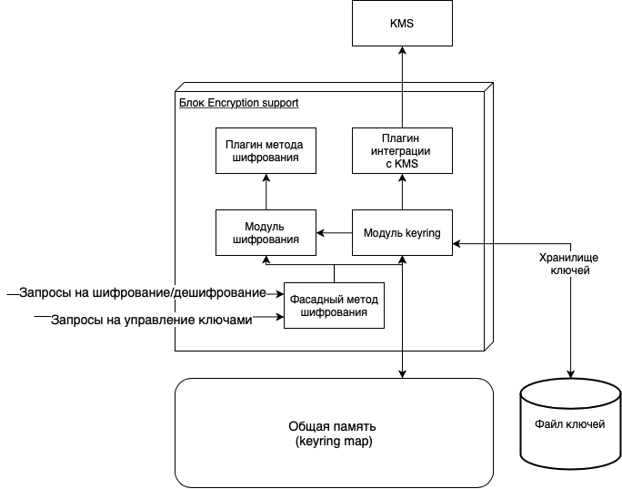

# Руководство по безопасному использованию Platform V Pangolin

Platform V Pangolin - система управления базами данных, основанная на PostgreSQL. В этом документе описываются аспекты Pangolin, связанные с безопасностью.

Этот документ предназначен для администраторов, разработчиков и специалистов по безопасности.

## Ролевая модель и права доступа
Для обеспечения контроля доступа к защищаемым элементам системы применяется система разграничения доступа, основанная на ролях.

Ролевая модель этой системы выглядит следующим образом:

| Роль                                                                               | Объект доступа                               | Право (тип доступа)                                                                                                                                                                                                                                                                                                                                                                                                                                                                                                                                                                                                                                                                        |
| ---------------------------------------------------------------------------------- | -------------------------------------------- | ------------------------------------------------------------------------------------------------------------------------------------------------------------------------------------------------------------------------------------------------------------------------------------------------------------------------------------------------------------------------------------------------------------------------------------------------------------------------------------------------------------------------------------------------------------------------------------------------------------------------------------------------------------------------------------------ |
| Администратор безопасности<br><br><br><br><br><br><br><br><br><br><br><br><br><br> | База данных                                  | Подключение к БД                                                                                                                                                                                                                                                                                                                                                                                                                                                                                                                                                                                                                                                                           |
|                                                                                    |                                              | Инициализация механизма защиты                                                                                                                                                                                                                                                                                                                                                                                                                                                                                                                                                                                                                                                             |
|                                                                                    | Объекты БД                                   | Право на помещение объекта БД под защиту механизма защиты (не RBAC!)                                                                                                                                                                                                                                                                                                                                                                                                                                                                                                                                                                                                                       |
|                                                                                    |                                              | Право на снятие защиты механизма защиты (не RBAC!) с объекта БД                                                                                                                                                                                                                                                                                                                                                                                                                                                                                                                                                                                                                            |
|                                                                                    | Политики доступа к объектам БД               | Право на создание политик доступа механизма защиты (не RBAC!) к объектам БД                                                                                                                                                                                                                                                                                                                                                                                                                                                                                                                                                                                                                |
|                                                                                    |                                              | Право на управление составом разрешений в политиках доступа механизма защиты (не RBAC!)                                                                                                                                                                                                                                                                                                                                                                                                                                                                                                                                                                                                    |
|                                                                                    |                                              | Право на назначение и изъятие политик доступа механизма защиты (не RBAC!) у пользователей БД, включая администратора БД                                                                                                                                                                                                                                                                                                                                                                                                                                                                                                                                                                    |
|                                                                                    | Пользователи и роли БД                       | Право на назначение пользователя администратором безопасности механизма защиты (не RBAC!)                                                                                                                                                                                                                                                                                                                                                                                                                                                                                                                                                                                                  |
|                                                                                    |                                              | Право на снятие с пользователя роли администратора безопасности механизма защиты (не RBAC!)                                                                                                                                                                                                                                                                                                                                                                                                                                                                                                                                                                                                |
|                                                                                    | Правила аутентификации                       | Право управления правилами аутентификации пользователей в защищенном хранилище (внешнее относительно Pangolin ) в режиме защищенного конфигурирования                                                                                                                                                                                                                                                                                                                                                                                                                                                                                                                                      |
|                                                                                    | Настройки БД                                 | Право управления настройками БД в защищенном хранилище (внешнее относительно Pangolin ) в режиме защищенного конфигурирования                                                                                                                                                                                                                                                                                                                                                                                                                                                                                                                                                              |
|                                                                                    |                                              | Право настройки параметров подключения БД к защищенному хранилищу (внешнее относительно Pangolin )                                                                                                                                                                                                                                                                                                                                                                                                                                                                                                                                                                                         |
|                                                                                    | Функции мониторинга параметров безопасности  | Право на вызов функций мониторинга параметров безопасности                                                                                                                                                                                                                                                                                                                                                                                                                                                                                                                                                                                                                                 |
|                                                                                    | Журнал аудита                                | Определяется правами ОС                                                                                                                                                                                                                                                                                                                                                                                                                                                                                                                                                                                                                                                                    |
|                                                                                    | Ключи шифрования Transparent Data Encryption | Право на выполнение ротации мастер-ключа шифрования                                                                                                                                                                                                                                                                                                                                                                                                                                                                                                                                                                                                                                        |
|                                                                                    |                                              | Право на установку мастер-ключа шифрования                                                                                                                                                                                                                                                                                                                                                                                                                                                                                                                                                                                                                                                 |
|                                                                                    |                                              | Право на выполнения перешифрования набора ключей шифрования                                                                                                                                                                                                                                                                                                                                                                                                                                                                                                                                                                                                                                |
|                                                                                    |                                              | Право на выполнение восстановления набора ключей шифрования после сбоя                                                                                                                                                                                                                                                                                                                                                                                                                                                                                                                                                                                                                     |
| Администратор БД                                                                   | Пользователи и роли БД                       | Полный доступ, за исключением пользователей и ролей, находящихся под защитой механизма защиты, включая:<br>- создание<br>- удаление<br>- изменение параметров пользователя или роли<br>- изменение прав в RBAC<br>- организация иерархии ролей в RBAC<br>, исключая<br>- назначение пользователя администратором безопасности механизма защиты<br>- снятие с пользователя прав администратора безопасности механизма защиты<br>- управление политиками доступа механизма защиты для пользователя<br><br>Для пользователей и ролей, находящихся под защитой механизма защиты, набор разрешенных действий определяется политиками, выданными администратору БД администратором безопасности. |
|                                                                                    | База данных                                  | Полный доступ                                                                                                                                                                                                                                                                                                                                                                                                                                                                                                                                                                                                                                                                              |
|                                                                                    | Табличное пространство                       | Полный доступ                                                                                                                                                                                                                                                                                                                                                                                                                                                                                                                                                                                                                                                                              |
|                                                                                    | Объекты БД                                   | Полный доступ, за исключением объектов, находящихся под защитой механизма защиты.<br><br>Для объектов, находящихся под защитой механизма защиты, набор разрешенных действия определяется политиками, выданными администратору БД администратором безопасности.                                                                                                                                                                                                                                                                                                                                                                                                                             |
|                                                                                    | Правила аутентификации                       | Право управления правилами аутентификации пользователей в локальных конфигурационных файлах вне режима защищенного конфигурирования                                                                                                                                                                                                                                                                                                                                                                                                                                                                                                                                                        |
|                                                                                    | Настройки БД                                 | Полный доступ, за исключением<br>- настроек взаимодействия с защищенным хранилищем;<br>- настроек в защищенном хранилище в режиме защищенного конфигурирования;                                                                                                                                                                                                                                                                                                                                                                                                                                                                                                                            |
|                                                                                    | Парольные политики пользователей             | Полный доступ                                                                                                                                                                                                                                                                                                                                                                                                                                                                                                                                                                                                                                                                              |
|                                                                                    | Настройки аудита                             | Полный доступ                                                                                                                                                                                                                                                                                                                                                                                                                                                                                                                                                                                                                                                                              |
|                                                                                    | Журнал аудита                                | Полный доступ                                                                                                                                                                                                                                                                                                                                                                                                                                                                                                                                                                                                                                                                              |
| Пользователь БД                                                                    | Пользователи и роли БД                       | В соответствии с правами в RBAC, за исключением пользователей и ролей, находящихся под защитой механизма защиты, исключая<br>- назначение пользователя администратором безопасности механизма защиты<br>- снятие с пользователя прав администратора безопасности механизма защиты<br>- управление политиками доступа механизма защиты для пользователя<br><br>Для пользователей и ролей, находящихся под защитой механизма защиты, набор разрешенных действий определяется политиками, выданными пользователю БД администратором безопасности и разрешениями в рамках RBAC.                                                                                                                |
|                                                                                    | База данных                                  | В соответствии с правами в RBAC                                                                                                                                                                                                                                                                                                                                                                                                                                                                                                                                                                                                                                                            |
|                                                                                    | Табличное пространство                       | В соответствии с правами в RBAC                                                                                                                                                                                                                                                                                                                                                                                                                                                                                                                                                                                                                                                            |
|                                                                                    | Объекты БД                                   | В соответствии с правами в RBAC, за исключением объектов, находящихся под защитой механизма защиты.<br><br>Для объектов, находящихся под защитой механизма защиты, набор разрешенных действий определяется политиками, выданными пользователю БД администратором безопасности и разрешениями в рамках RBAC.                                                                                                                                                                                                                                                                                                                                                                                |
|                                                                                    | Настройки БД                                 | В соответствии с правами в RBAC, за исключением<br>- настроек взаимодействия с защищенным хранилищем;<br>- настроек в защищенном хранилище в режиме защищенного конфигурирования;                                                                                                                                                                                                                                                                                                                                                                                                                                                                                                          |
|                                                                                    | Парольные политики пользователей             | В соответствии с правами в RBAC                                                                                                                                                                                                                                                                                                                                                                                                                                                                                                                                                                                                                                                            |
|                                                                                    | Настройки аудита                             | В соответствии с правами в RBAC                                                                                                                                                                                                                                                                                                                                                                                                                                                                                                                                                                                                                                                            |

Права доступа пользователей устанавливаются в соответствии с ролевой моделью.

### Операции, которые не должны выполняться одним лицом

Следующие операции имеют критическое значение для безопасности, поэтому не могут быть выполнены одним лицом:

1. Выполнение общих настроек, влияющих на возможность несанкицонированного доступа к передаваемой или хранимой информации:

    -   настройки защиты сетевых соединений;
    -   настройки состава загружаемых модулей расширения;
    -   настройки состава доверенных серверов аутентификации;
    -   настройки включения прозрачного шифрования данных.
 
2. Управление доступом к объектам баз данных, содержащих конфиденциальную или секретную информацию

## Механизмы безопасности
В этом разделе описаны механизмы безопасности, реализованные в продукте.

### Аутентификация

Pangolin поддерживает несколько типов авторизации и аутентификации пользователей и сервисов:

-   trust - **Не рекомендуется**

    Любой пользователь, подключающийся к серверу, авторизован для доступа

-   password - **Не рекомендуется**

    Авторизация с помощью пароля, передаваемого в виде хэша MD5 или открытым текстом

-   GSSAPI

    Протокол авторизации по стандарту RFC 2743

-   SSPI

    Технология защищенной аутентификации Windows - **Не поддерживается на рекомендованной ОС**

-   ident - **Не рекомендуется**

    Аутентификация с использованием сервера `ident` по стандарту RFC 1413

-   peer - **Не рекомендуется**

    Получение имени пользователя клиента из ядра и использование его в качестве авторизованного имени пользователя БД

-   LDAP

    Аналогично `password`, но для подтверждения пары "имя пользователя / пароль" используется метод LDAP

-   RADIUS

    Аналогично `password`, но для подтверждения пары "имя пользователя / пароль" используется метод RADIUS

-   Аутентификация по сертификату

    Аутентификация с использованием клиентского сертификата SSL. Применимо только для SSL-подключений

-   PAM

    Аналогично `password`, но для подтверждения пары "имя пользователя / пароль" используется метод PAM. Также поддерживается проверка имени и IP удаленного компьютера

-   BSD

    Аналогично `password`, но для подтверждения пары "имя пользователя / пароль" используется метод BSD

#### Защита аутентификационной информации

В Platform V Pangolin реализована защита аутентификационной информации в процессе ее ввода.При аутентификации через утилиту `psql` вводимые пользователем символы пароля не отображаются.

Перечисленные ниже способы аутентификации передают аутентификационную информацию в открытом виде:

-   файл `pgpass`
-   строки параметров подключения (Connection string)
-   переменная окружения `PGPASSWORD`

Эти способы аутентификации использовать не рекомендуется.

### Авторизация

Предоставление прав пользователям осуществляется в соответствии с ролевой системой и механизмом защиты данных от привилегированных пользователей. 

Ролевая система описана в разделе **Ролевая модель и права доступа**.

Механизм защиты данных от привилегированных пользователей описан в разделе **Защита от привилегированных пользователей**.

#### Автоматическое завершение неактивных соединений

Соединения, остающиеся неактивными определенное время, подлежат принудительному завершению.
Для завершения таких соединений используется фоновый процесс, осуществляющий мониторинг и завершение бездействующих клиентских сеансов. Этот процесс запускается при старте сервера Pangolin и завершается вместе с остановкой сервера.

Процесс регулируется двумя параметрами:

-   `check_idle_time_delay` - интервал мониторинга в миллисекундах;
-   `backend_idle_alive_time` - допустимое время бездействия в секундах.

Если хотя бы один из этих параметров равен нулю, неактивные соединения завершаться не будут.

### Управление парольными политиками: PL/pgSQL API

Все запросы к базе выполняются через SPI интерфейс (т.е. не через внутренний API АС Platform V Pangolin), так как вероятность изменения SQL интерфейса меньше.

#### Вывод парольной политики, примененной для пользователя или роли

Вывод политики, приписанной этой роли

*Формат*

-   `recognize_password_policy(name role_name)` - по имени роли;
-   `recognize_password_policy_by_role_id(oid roleid)` - по идентификатору роли.

*Входные атрибуты*

-   `role_name` – имя роли;
-   `role_id` – идентификатор роли.

*Возвращаемое значение*

-   Кортеж с описанием политики.

#### Вывод детализированной информации по примененной парольной политики для пользователя или роли

Вывод эффективной политики, получившейся в сценарии (выбор политики для пользователя) с указанием какая политика из какой роли (или из postgresql.conf) действует.

*Формат*

-   `recognize_password_policy_detailed(name role_name)` - по имени роли;
-   `recognize_password_policy_detailed_by_role_id(oid roleid)`- по идентификатору роли.

*Входные атрибуты*

-   `role_name` – имя роли;
-   `role_id` – идентификатор роли.

*Возвращаемое значение*

-   Кортеж с политикой с полями, указывающими роль (или строку config) для каждой политики.

### Управление учетными записями

Учетные записи пользователей и технические учетные записи создаются, удаляются и изменяются администраторами безопасности и администраторами Pangolin.

Разрешения для учетных записей регулируются политиками, которые определяют права доступа той или иной роли к объектам базы данных.

Парольные политики описываются в разделе **Интерфейс управления парольными политиками: PL/pgSQL API**.

### Безопасность данных

В этом разделе описываются механизмы разграничения доступа к данным.

#### Управление доступом на уровне ролей (RBAC)

Система ограничивает доступ пользователей к объектам БД в зависимости от их роли и привилегий, которые назначены для этой роли.

#### Row level security

Механизм ограничения доступа пользователей к отдельным строкам в таблицах.

#### Защита от привилегированных пользователей

В Platform V Pangolin используется механизм защиты данных от привилегированных пользователей, построенный на принципе разделения ролей. 

В стандартном PostgreSQL привилегированные пользователи имеют доступ к объектам БД и настройкам подключения:

-   администраторы БД имеют произвольный доступ к любым пользовательским данным, что может привести к утечкам конфиденциальной информации;
-   администраторы ОС могут менять настройки БД таким образом, чтобы получать доступ к пользовательским данным, что тоже ведет к утечкам.

В Platform V Pangolin Администраторы БД и ОС теряют возможность самостоятельно управлять некоторыми параметрами и перестают иметь полный доступ ко всем объектам БД. 

В дополнение к роли суперпользователя, которая есть в стандартной версии PostgreSQL, в Pangolin можно создать специальную роль Администратора безопасности (АБ).

АБ – независимый администратор, не обладающий особыми правами в операционной системе (в том числе не имеющий прав Linux-пользователя postgres) и не имеющий доступа к объектам БД. Внутри БД роль Администратора безопасности является особенной в том смысле, что она не доступна для изменения суперпользователем.

Таким образом, ни один из пользователей не может единолично получить доступ к конфиденциальным данным или изменять важные для безопасности настройки БД и права доступа.

### Прозрачное шифрование данных

В Platform V Pangolin используется прозрачное шифрование данных (TDE). С его помощью шифруются данные, хранящиеся в файлах данных, журналах изменений, резервных копиях и временных файлах баз данных, а также данные, передаваемые по каналам связи в ходе физической и логической репликации.

Для шифрования данных используется алгоритм шифрования AES, реализованный в рамках модуля *Encryption support*. Ключи шифрования организуются в двухуровневую иерархию, корнем которой является регулярно изменяющийся мастер-ключ. Мастер-ключ используется для шифрования ключей второго уровня (ключей шифрования объектов баз данных).

Ключи шифрования второго уровня не ротируются, поэтому при смене мастер-ключа перешифровывать данные не требуется. Ротация мастер-ключа инициируется и выполняется на главном сервере СУБД.



### Средства криптографической защиты информации

В качестве СКЗИ используется открытая криптографическая библиотека `OpenSSL`. Она обеспечивает шифрование трафика между сервером и клиентом.

### Управление ключами и сертификатами

Pangolin поддерживает работу с клиентскими сертификатами. Список доверенных центров сертификации хранится в файле `postgresql.conf`.

Если использование сертификатов включено, при подключении клиента по SSL будет затребован сертификат, а Pangolin проверит, подписан ли сертификат одним из доверенных центров сертификации.

*Файлы, используемые системой управления сертификатами*

| Файл | Содержимое |
|---|---|---|
| ssl_cert_file($PGDATA/server.crt) | Сертификат сервера |
| ssl_key_file($PGDATA/server.key) | Закрытый ключ сервера |
| ssl_ca_file($PGDATA/root.crt) | Сертификаты доверенных центров сертификации |
| ssl_crl_file($PGDATA/root.crl) | Сертификаты, отозванные центрами сертификации |

### Журналирование и аудит

Для журналирования и аудита событий безопасности используется модифицированное расширение `pgAudit`. Оно обеспечивает детальное журналирование сессий и объектов для целей аудита. События подключения и события настройки механизма защиты данных в отдельные классы регистрируемых событий для предоставления возможности гибкой настройки аудита. `pgAudit` заменяет стандартное средство журналирования PostgreSQL.

#### Формат

Записи аудита записываются в стандартное средство ведения журнала и содержат следующие столбцы в формате CSV. Выходные данные соответствуют формату CSV только в том случае, если префикс строки журнала каждой записи удален.

-   **AUDIT\_TYPE** - `SESSION` или `OBJECT`;
-   **STATEMENT\_ID** - Уникальный идентификатор оператора для этой сессии. Каждый идентификатор оператора представляет собой внутренний вызов. Идентификаторы операторов идут последовательно, даже если некоторые операторы не регистрируются. Когда регистрируется более одного отношения, для одного идентификатора оператора может быть несколько записей;
-   **SUBSTATEMENT\_ID** - Последовательный идентификатор для каждого вложенного оператора в основном операторе. Например, вызов функции из запроса. Идентификаторы вложенных операторов идут последовательно, даже если некоторые вложенные операторы не регистрируются. Когда регистрируется более одного отношения, для одного идентификатора вложенного оператора может быть несколько записей;
-   **CLASS** - `READ`, `ROLE` и т.д. (см. раздел `pgaudit.log`);
-   **COMMAND** - `ALTER TABLE`, `SELECT` и т.д;
-   **OBJECT\_TYPE** - `TABLE`, `INDEX`, `VIEW` и т.д. Применимо для `SELECT`, `DML` и большинства `DDL`;
-   **OBJECT\_NAME** - Полное имя объекта (например, `public.account`). Применимо для `SELECT`, `DML` и большинства `DDL`;
-   **STATEMENT** - Операция, выполняемая на сервере;
-   **PARAMETER** - Если параметр pgaudit.log\_parameter включен, здесь в кавычках будут перечислены параметры в формате CSV. Если параметров нет, здесь будет `<none>`. Иначе в этом поле будет запись `<not logged>`;
-   **EXECUTION\_RESULT** - Если операция завершается с ошибкой, вызванной недостаточными привилегиями или механизмом защиты от привилегированных пользователей, в этом поле будет запись `ERROR: INSUFFICIENT PRIVILEGE`. Если операция выполнена успешно и оператор принадлежит к классу `PROTECTION`, в поле заносится запись `SUCCESS`.

У записей класса `CONNECTION` собственный формат.

-   **AUDIT\_TYPE** - Всегда `SESSION`;
-   **CLASS** - Всегда `CONNECTION`;
-   **EVENT** - `OPEN`, `CLOSED`, `FAILED`, `CHANGE USER`;
-   **SESSION\_TIME** - Только для события `CLOSED`. Формат записи: "`session time: %d:%02d:%02d.%03d`" - часы, минуты, секунды, миллисекунды соответственно.
-   **DATA\_BASE** - Имя базы данных, к которой осуществляется подключение. Формат записи: - "`database = %s`" (имя базы данных).
-   **USER** - Имя пользователя, подключающегося к базе данных. Формат записи: - "`user = %s`" (имя пользователя).

Для добавления любых других полей, необходимых для удовлетворения ваших требований к журналу аудита, может использоваться префикс строки журнала ([log\_line\_prefix](http://www.postgresql.org/docs/11/static/runtime-config-logging.html#GUC-LOG-LINE-PREFIX)). Пример префикса строки журнала: "`%m %u %d \[%p\]:`" - включить дату/время, имя пользователя, имя базы данных и идентификатор процесса для каждой записи журнала аудита.

#### pg_stat_statements

Расширение `pg_stat_statements` входит в основной состав Platform V Pangolin. 
Это расширение осуществляет сбор статистики выполнения сервером всех запросов SQL.

##### Файл статистики

Расширение `pg_stat_statements` записывает запросы, поступающие на базу данных Pangolin, в файл статистики `$PGDATA/pg_stat_tmp/pgss_query_texts.stat`.

Параметры запросов заносятся в файл статистики в нормализованном виде. Например, запрос

```SQL
select * from test_table_1 where id=4 and str='test_data_4';
```

будет записан в файл статистики в следующем виде:

```SQL
select * from test_table_1 where id=$1 and str=$2
```

При этом если запросы DML (`select`, `update`, `delete`, `insert`) вложены в операторы утилит (все, кроме DML: `explain`, `create`, `copy` и др.), то параметры этих запросов будут записаны в файл статистики в открытом виде, например:

Запрос:

```SQL
explain analyze select * from test_table_1 where id=4 and str='test_data_4';
```

Запись в файле статистики:

```SQL
explain analyze select * from test_table_1 where id=4 and str='test_data_4'
```

Запрос:

```SQL
create table test_table_2 as select id, str from test_table_1 where id=4 and str='test_data_4';	
```

Запись в файле статистики:

```SQL
create table test_table_2 as select id, str from test_table_1 where id=4 and str='test_data_4'
```

Запрос:

```SQL
COPY (SELECT * FROM test_table_1 where id=4 and str='test_data_4') TO STDOUT;	
```

Запись в файле статистики:

```SQL
COPY (SELECT * FROM test_table_1 where id=4 and str='test_data_4') TO STDOUT
```

Запросы такого рода использовать в системах, содержащих конфиденциальную информацию, не рекомендуется.


## Безопасная настройка продукта

В этом разделе приведены рекомендации по безпасной настройке продукта и его компонентов.

### Парольные политики

#### Создание или изменение парольной политики

Для изменения параметра policy\_enable используйте функции активации и деактивации политики.

*Формат*

-    `set_role_policies(name role_name, policy1[, policy2[, ...]]);` - по имени роли;
-    `set_role_policies_by_id(oid role_id, policy1[, policy2[, ...]]);` - по идентификатору роли.

*Входные атрибуты*

-    `role_name` – имя роли;
-    `role_id` – идентификатор роли;
-    `policy1, policy2, …` – значение настройки парольной политики, задаётся специальной функцией.

    | Имя настройки парольной политики | Функция и ее синонимы | POSIX  шаблон для <value> |
    |---|---|---|
    | reusetime | reuse_time('<value>') |
    | inhistory | in_history('<value>') | `\d+` |
    | maxage | max_age('<value>') | `\d+ s` |
    | minage  | min_age('<value>') | `\d+ s` |
    | graceloginlimit | grace_login_limit('<value>') | `\d+`                         |
    | gracelogintimelimit                | grace_login_time_limit('<value>'),   grace_lti('<value>')             | `\d+ s`                       |
    | expirewarning                      | expire_warning('<value>')                                             | `\d+ s`                       |
    | lockout                            | lockout('<value>')                                                    | `true\false`                 |
    | lockoutduration                    | lockout_duration(),   lduration('<value>')                            | `\d+ s`                       |
    | maxfailure                         | max_failure('<value>')                                                | `\d+`                         |
    | failurecountinterval               | failure_count_interval('<value>'), fc_interval('<value>')             | `\d+ s`                       |
    | checksyntax                        | check_syntax('<value>')                                               | `true|false`                 |
    | minlength                          | min_length('<value>')                                                 | `\d+`                         |
    | illegalvalues                      | illegal_values('<value>')                                             | `true|false`                 |
    | alphanumeric                       | alpha_numeric('<value>')                                              | `\d+`                         |
    | minalphachars                      | min_alpha_chars('<value>')                                            | `\d+`                         |
    | minspecialchars                    | min_special_chars('<value>')                                          | `\d+`                         |
    | minuppercase                       | min_uppercase('<value>')                                              | `\d+`                         |
    | minlowercase                       | min_lowercase('<value>')                                              | `\d+`                         |
    | maxrptchars                        | max_rpt_chars('<value>')                                              | `\d+`                         |
    | policyenable                       | policy_enable('<value>')                                              | `true|false`                 |
    | tracklogin                         | track_login('<value>')                                                | `true|false`                 |
    | maxinactivity                      | max_inactivity('<value>')                                             | `\d+ s`                       |
    | usepasswordstrengthestimator       | use_password_strength_estimator('<value>'), use_zxcvbn('<value>')     | `true|false`                 |
    | passwordstrengthestimatorscore     | password_strength_estimator_score('<value>'), zxcvbn_score('<value>') | `[0-4]`                       |
    | customfunction                     | custom_function('<value>')                                            | `[\w\d]+`                     |

*Возвращаемое значение*

-   Функция вернет такой же результат, как функция `recognize_password_policy`, отобразив изменения.

*Пример*

Для пользователя `pg_user_name` установить максимальное количество подряд неверно введённых паролей 3 (`maxfailure`), время блокировки аккаунта (`lockoutduration`) 10 секунд.

```
select set_role_policies('pg_user_name', max_failure('3'), lockout_duration('10 s'));
```

#### Активация парольной политики

*Формат*

-   `enable_policy(name role_name);` - по имени роли;
-   `enable_policy(oid role_id);` - по идентификатору роли.

*Входные атрибуты*

-   `role_name` – имя роли;
-   `role_id` – идентификатор роли.

*Возвращаемое значение*

-   Функция вернет такой же результат, как функция `recognize_password_policy`, отобразив изменения.

#### Деактивация парольной политики

*Формат*

-   `disable_policy(name role_name);` - по имени роли;
-   `disable_policy(oid role_id);` - по идентификатору роли.

*Входные атрибуты*

-   `role_name` – имя роли;
-   `role_id` – идентификатор роли.

*Возвращаемое значение*

-   Функция вернет такой же результат, как функция `recognize_password_policy`, отобразив изменения.

#### Вывод всех политик

Поиск всех ролей, к которым прикреплены политики паролей.

*Формат*

-   `select_all_password_policies()`

*Входные атрибуты*

-   Нет

*Возвращаемое значение*

-   Кортеж со всеми найденными ролями.

#### Разблокировка пользователя или роли

Разблокировать пользователя, заблокированного в результате превышения максимального количества неудачных попыток аутентификации по паролю или долгой неактивности.

*Формат*

-   `unblock_role(name role_name)` - по имени роли;
-   `unblock_role_by_id(oid roleid)` - по идентификатору роли.

*Входные атрибуты*

-   `role_name` – имя роли;
-   `role_id` – идентификатор роли.

*Возвращаемое значение*

-   Для заданного пользователя или роли изменяется значение полей:

    -   `failcounter=0`
    -   `unblockexpirytime = <текущее время на сервере>`

### Средства администрирования

#### HashiCorp Vault

Решение HashiCorp Vault используется в качестве защищенного хранилища ключей шифрования и настроек, а также как система управления ключами.

##### Настройка подключения

В системе используются механизм защиты данных от привилегированных пользователей и механизм прозрачного шифрования данных. Их функционирование описывается в соответствующих разделах.
Оба механизма используют сервис управления ключами (KMS).

В обязанности администратора безопасности входит настройка соединения со службой управления ключами (KMS). Если на сервере настроены параметры KMS, то при выполнении команды `initdb` происходит конфликт между параметрами локальной и удаленной конфигурации.
Чтобы восстановить возможность инициализировать новые базы данных, переместите или удалите файл `/etc/postgres/enc_connection_settings.cfg`.

Настройка соединения с KMS осуществляется через утилиту `setup_kms_credentials`:

1.  Запустите `setup_kms_credentials` на экземпляре СУБД Pangolin.
2.  Вы увидите сообщение с предложением выбрать, для какого домена задать идентификационные данные: KMS или POSTGRESQL. Выберите первый вариант.

    ```
        Choose credentials domain:
        1. KMS					<-
        2. POSTGRESQL
    ```

3.  Вы увидите сообщение с предложением указать ID кластера PostgreSQL:

    ```
        Enter PostgreSQL cluster ID:
        2						<-
    ```

4.  Вы увидите сообщение с предложением указать IP-адрес и порт KMS:

    ```
        Enter IP address:
        10.53.116.39				<-
        Enter port:
        82002						<-
    ```

5.  Вы увидите сообщение с предложением выбрать метод аутентификации: Userpass или AppRole. Выберите первый вариант.

    ```
        Choose credentials type:
        1. Userpass Auth Method	<-
        2. AppRole Auth Method
    ```

6.  Вы увидите предложение указать логин и пароль и подтвердить пароль:

    ```
        Enter login:
        adminencryption			<-
        Enter password:
        ****					<-
        Confirm password:
        ****					<-
    ```

7.  Вы увидите предложение добавить настройки для еще одного KMS:

    ```
        Do you want to add another KMS credentials? (yes/no)?:
        no						<-
    ```

8.  Если установка идентификационных данных выполнена успешно, вы увидите следующее сообщение:

    ```
        Credentials for KMS has been set successfully
    ```

    Если при установке возникли проблемы, воспользуйтесь командой:

    ```
        setup_kms_credentials --help
    ```

9.  Установите необходимые права доступа на созданный файл настроек. Для этого введите в консоли команду:

    ```
        $ chmod 600 /etc/postgres/enc_connection_settings.cfg
    ```

Настройка соединения с системой управления ключами завершена.

### Сетевая безопасность

Для использования шифрования между клиентом и сервером необходимо настроить `OpenSSL` на клиенте и на сервере. 

SSL включается с помощью парметра `ssl = on` в файле `postgresql.conf`.

SSL использует файлы сертификата и закрытого ключа сервера. По умолчанию они называются `server.crt` и `server.key`. Эти названия менять не рекомендуется.

Доступ к файлу `server.key` должен быть ограничен командой `chmod 0600 server.key`.

Чтобы клиенты могли подключаться к серверу с помощью сертификатов, поместите сертификаты корневых центров сертификации в каталог `data`, укажите имя файла с сертификатами в параметре `ssl_ca_file` в `postgresql.conf`.

После этого добавьте параметр `clientcert=1` в соответствующие строки `hostssl` в файле `pg_hba.conf`.

### Журналирование и аудит

Настройки могут быть изменены только суперпользователем. Если разрешить обычным пользователям изменять свои настройки, то ведение журнала аудита теряет смысл.

Настройки могут быть заданы глобально (в файле `postgresql.conf` или с помощью `ALTER SYSTEM ... SET)`, на уровне базы данных (с помощью `ALTER DATABASE ... SET`) или на уровне роли (с помощью `ALTER ROLE ... SET`). Обратите внимание, что настройки не наследуются через обычное наследование ролей, и `SET ROLE` не изменит настройки pgAudit пользователя. Это ограничение системы ролей, а не особенность pgAudit.

Расширение pgAudit должно быть загружено в [shared\_preload\_libraries](http://www.postgresql.org/docs/11/static/runtime-config-client.html#GUC-SHARED-PRELOAD-LIBRARIES). В противном случае во время загрузки возникнет ошибка, и ведение журнала аудита не будет происходить. Кроме того, C`REATE EXTENSION pgaudit` следует вызвать до того, как будут заданы параметры `pgaudit.log`. Если расширение pgaudit удалено и его необходимо воссоздать, то сначала должен быть удален `pgaudit.log`, иначе возникнет ошибка.

#### pgaudit.log

Указывает, какие классы операторов будут регистрироваться при ведении журнала аудита сессии. Возможные значения:

-   **READ**: `SELECT `и `COPY`, если источник - отношение или запрос;
-   **WRITE**: `INSERT`, `UPDATE`, `DELETE`, `TRUNCATE`, и `COPY`, если цель - отношение;
-   **FUNCTION**: Вызовы функций и блоки `DO`;
-   **ROLE**: Операторы, связанные с ролями и привилегиями: `GRANT`, `REVOKE`, `CREATE/ALTER/DROP ROLE`;
-   **DDL**: Все `DDL`, не входящие в класс `ROLE`;
-   **MISC**: Прочие команды, включая `DISCARD`, `FETCH`, `CHECKPOINT`, `VACUUM`, `SET`;
-   **MISC\_SET**: Прочие команды `SET`, включая `SET ROLE`;
-   **CONNECTION**: События, связанные с подключением к серверу. Существуют 4 типа таких событий: `OPEN`, `CLOSED`, `FAILED`, `CHANGE USER`. Событие `FAILED` регистрируется в случае неудачной попытки аутентификации по паролю и независимо от значения `pgaudit.log`;
-   **PROTECTION**: Функции настройки механизма защиты от привилегированных пользователей;
-   **ALL**: Включить всё вышеперечисленное.

Можно включить несколько классов, перечислив их через запятую, или исключить определеные классы, поставив перед ними знак `-` (см. раздел Журнал аудита сессии).

Значение по умолчанию - `none`.

#### pgaudit.log\_catalog

Указывает, должно ли быть включено ведение журнала сессии в том случае, если все отношения в операторе находятся в pg\_catalog. Отключение этого параметра уменьшит шум в журнале от таких инструментов, как psql и pgAdmin, которые часто обращаются к каталогу.

Значение по умолчанию - `on`.

#### pgaudit.log\_client

Указывает, будут ли сообщения журнала видны клиентскому процессу, такому как psql. Этот параметр обычно следует оставить отключенным, но он может быть полезен для отладки или других целей.

Обратите внимание, что `pgaudit.log\_level` включен только тогда, когда `pgaudit.log\_client` **включен**.

Значение по умолчанию - `off`.

#### pgaudit.log\_level

Указывает уровень журналирования, который будет использоваться для записей журнала (см. [Уровни важности сообщений](http://www.postgresql.org/docs/9.4/static/runtime-config-logging.html#RUNTIME-CONFIG-SEVERITY-LEVELS)). Обратите внимание, что значения `ERROR`, `FATAL` и `PANIC` не допускаются). Этот параметр используется для регрессионного тестирования, а также может быть полезен конечным пользователям для тестирования или других целей.

`pgaudit.log\_level` включен только тогда, когда `pgaudit.log\_client` **включен**; в противном случае будет использоваться значение по умолчанию.

Значение по умолчанию - `log`.

#### pgaudit.log\_parameter

Указывает, что ведение журнала аудита должно включать параметры, переданные вместе с оператором. При наличии параметров они будут включены в формате `CSV` после текста оператора.

Значение по умолчанию - `off`.

#### pgaudit.log\_relation

Указывает, должно ли ведение журнала аудита сессии создавать отдельную запись журнала для каждого отношения (`TABLE`, `VIEW` и т.д.), на которое ссылается оператор `SELECT` или `DML`. Это полезный прием для исчерпывающего ведения журнала без использования журнала аудита объектов.

Значение по умолчанию - `off`.

#### pgaudit.log\_statement\_once

Указывает, будут ли текст и параметры оператора прикрепляться к первой записи в журнале для комбинации оператора и вложенных операторов или к каждой записи. Отключение этого параметра приведет к менее подробному ведению журнала, но может затруднить определение оператора, сгенерировавшего запись журнала, хотя пары оператора и вложенного оператора вместе с идентификатором процесса должно быть достаточно для идентификации текста оператора, записанного в предыдущей записи.

Значение по умолчанию - `off`.

#### pgaudit.role

Указывает главную роль, используемую для ведения журнала аудита объектов. Можно определить несколько ролей аудита, предоставив их главной роли. Это позволяет нескольким группам отвечать за различные аспекты ведения журнала аудита.

Значения по умолчанию нет.

#### Ведение журнала аудита сессии

Журнал аудита сессии предоставляет подробные записи всех операций, выполняемых пользователем на сервере.

##### Конфигурация

Ведение журнала сессии включается с помощью параметра `pgaudit.log`.

Включить ведение журнала сессии для всех `DML` и `DDL` и протоколировать все отношения в операторах DML:

```
set pgaudit.log = 'write, ddl';

set pgaudit.log\_relation = on;
```

Включить ведение журнала сессии для всех команд, кроме `MISC`, и выводить сообщения журнала аудита с пометкой `NOTICE`:
```
set pgaudit.log = 'all, -misc';

set pgaudit.log\_level = notice;
```

##### Пример

В этом примере ведение журнала аудита сессии используется для ведения журнала операторов `DDL` и `SELECT`. Обратите внимание, что оператор `INSERT` не регистрируется, так как класс `WRITE` не включен.

*SQL*:
```SQL
set pgaudit.log = 'read, ddl';

create table account
(
    id int,
    name text,
    password text,
    description text
);

insert into account (id, name, password, description)
             values (1, 'user1', 'password1', 'blah, blah');

select *
    from account;
```

*Вывод в журнале*:
```SQL
AUDIT: SESSION,1,1,DDL,CREATE TABLE,TABLE,public.account,create table account
(
    id int,
    name text,
    password text,
    description text
);,<not logged>
AUDIT: SESSION,2,1,READ,SELECT,,,select *
    from account,,<not logged>
```

#### Ведение журнала аудита объектов

Журнал аудита объектов регистрирует операторы, влияющие на определенное отношение. Поддерживаются только команды `SELECT`, `INSERT`, `UPDATE` и `DELETE`. `TRUNCATE` не включается в журнал аудита объектов.

Ведение журнала аудита объектов - более подробная альтернатива `pgaudit.log = 'read, write'`. Таким образом, возможно, нет смысла использовать их вместе, но можно, например, использовать ведение журнала сеансов для регистрации каждого оператора, а затем дополнить его ведением журнала объектов, чтобы получить более подробную информацию о конкретных отношениях.

##### Конфигурация

Ведение журнала аудита на уровне объектов осуществляется через систему ролей. Параметр `pgaudit.role` определяет роль, которая будет использоваться для ведения журнала аудита. Отношение (`TABLE`, `VIEW`) будет записываться в журнал аудита, если роль аудита имеет разрешения для выполняемой команды или наследует разрешения от другой роли. Это позволяет эффективно использовать несколько ролей аудита, даже если в любом контексте существует одна главная роль.

Задайте для `pgaudit.role` значение `auditor` и наделите её правами `SELECT` и `DELETE` над таблицей `account`. Теперь операции `SELECT` и `DELETE` над таблицей `account` будут заноситься в журнал:

```SQL
set pgaudit.role = 'auditor';

grant select, delete
   on public.account
   to auditor;
```

##### Пример

В этом примере ведение журнала аудита объектов используется для иллюстрации того, как может быть применен детализированный подход к журналированию операторов `SELECT` и `DML`. Обратите внимание, что ведение журнала операций над таблицей `account` контролируется разрешениями на уровне столбцов, а ведение журнала операций над табицей `account\_role\_map` - на уровне таблиц.

*SQL*:
```SQL
set pgaudit.role = 'auditor';

create table account
(
    id int,
    name text,
    password text,
    description text
);

grant select (password)
   on public.account
   to auditor;

select id, name
  from account;

select password
  from account;

grant update (name, password)
   on public.account
   to auditor;

update account
   set description = 'yada, yada';

update account
   set password = 'password2';

create table account_role_map
(
    account_id int,
    role_id int
);

grant select
   on public.account_role_map
   to auditor;

select account.password,
       account_role_map.role_id
  from account
       inner join account_role_map
            on account.id = account_role_map.account_id
```

*Вывод в журнале*:
```SQL
AUDIT: OBJECT,1,1,READ,SELECT,TABLE,public.account,select password
  from account,<not logged>
AUDIT: OBJECT,2,1,WRITE,UPDATE,TABLE,public.account,update account
   set password = 'password2',<not logged>
AUDIT: OBJECT,3,1,READ,SELECT,TABLE,public.account,select account.password,
       account_role_map.role_id
  from account
       inner join account_role_map
            on account.id = account_role_map.account_id,<not logged>
AUDIT: OBJECT,3,1,READ,SELECT,TABLE,public.account_role_map,select account.password,
       account_role_map.role_id
  from account
       inner join account_role_map
            on account.id = account_role_map.account_id,<not logged>
            
```

#### Рекомендации

В зависимости от настроек журнал pgAudit может достигать очень больших объемов. Следует максимально точно определить, что именно должно быть записано в журнал аудита в вашей среде, чтобы избежать слишком большого количества записей.

Например, при работе в среде OLAP, вероятно, было бы неразумно проверять вставки журналов в большую таблицу фактов. Размер файла журнала, скорее всего, будет во много раз больше фактического размера данных вставок, поскольку файл журнала хранится в текстовом виде. Поскольку журналы обычно хранятся на диске вместе с ОС, это может привести к очень быстрому исчерпанию дискового пространства. В тех случаях, когда невозможно ограничить ведение журнала аудита определенными таблицами, обязательно оцените влияние на производительность во время тестирования и выделите достаточно места на томе журнала. Это также может быть верно для сред OLTP. Даже если объем операций вставки не так высок, влияние журнала аудита на производительность все равно может привести к заметному росту задержки.

Чтобы ограничить количество записей аудита отношений для операторов `SELECT` и `DML`, рассмотрите возможность использования журнала аудита объектов (см. раздел Аудит объектов). Ведение журнала аудита объектов позволяет выбрать отношения, которые будут регистрироваться, что позволяет уменьшить общий объем журнала. Однако все новые создаваемые отношения должны быть явно добавлены в журнал аудита объектов. В этом случае хорошим вариантом может быть программное решение, в котором некоторые определенные таблицы исключаются из ведения журнала, а все остальные включаются.